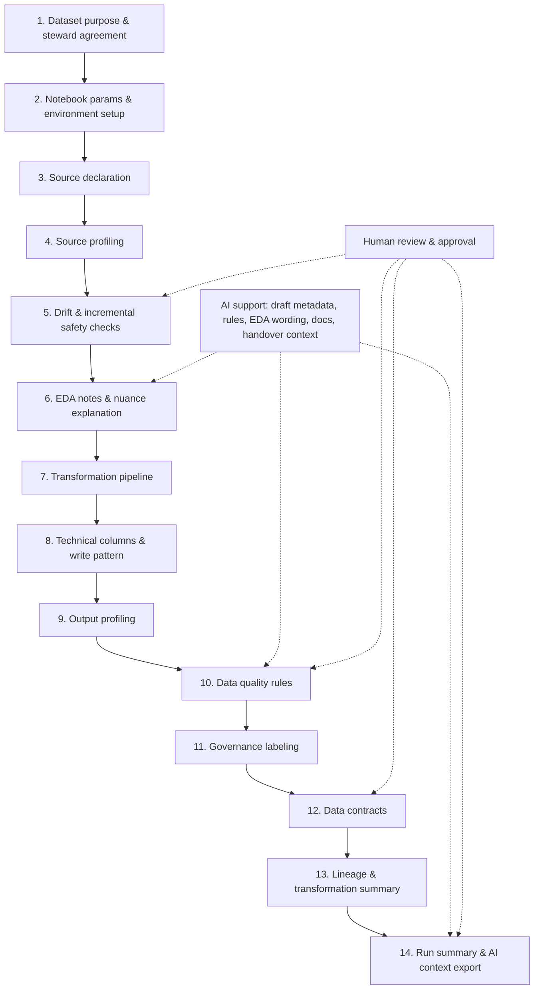

# Fabric Data Product Framework

A reusable Microsoft Fabric notebook framework for turning raw data into documented, quality-checked, governed, AI-ready data products.

## What this framework is for

This framework helps Python-proficient data practitioners deliver consistent Fabric data products without first mastering every Fabric engineering best practice. It provides a practical notebook lifecycle, reusable templates, and metadata outputs that support onboarding, review, and handover.

## Core idea

**AI proposes. Humans approve. Pipelines enforce. Documentation updates automatically.**

## Core lifecycle

Use this lifecycle as the default operating model for each dataset.

| Step | Lifecycle stage | Purpose | Output |
|---|---|---|---|
| 1 | Dataset purpose and steward agreement | Define business purpose, scope, steward, and expected usage. | Dataset purpose note |
| 2 | Notebook parameters and environment setup | Set runtime parameters, paths, target tables, and execution mode. | Run configuration for the notebook execution |
| 3 | Source declaration | Register declared sources, keys, refresh expectations, and ingestion intent. | Source registry |
| 4 | Source profiling | Profile input shape, nulls, distributions, and basic quality indicators. | Source profile |
| 5 | Schema drift, data drift, and incremental safety checks | Compare current vs baseline structure and behavior before transforms; verify incremental boundaries. | Drift check result |
| 6 | EDA notes and data nuance explanation | Capture observed quirks, caveats, and business-relevant interpretation notes. | EDA notes |
| 7 | Transformation pipeline | Apply business logic from raw/bronze to curated outputs with reproducible steps. | Transformation summary |
| 8 | Technical columns and write pattern | Apply audit columns, watermark/version columns, partition/write rules, and persistence pattern. | Managed output write with technical metadata |
| 9 | Output profiling | Re-profile final output to confirm expected shape and characteristics. | Output profile |
| 10 | Data quality rules | Run required checks (completeness, validity, consistency, thresholds) and capture pass/fail details. | Data quality result |
| 11 | Governance labeling | Apply sensitivity/classification labels and usage controls in documented form. | Governance label result |
| 12 | Data contracts | Validate and publish dataset contract expectations for schema, semantics, and constraints. | Data contract |
| 13 | Lineage and transformation summary | Record lineage and summarize how each output is derived. | Lineage summary |
| 14 | Run summary and AI context export | Produce run summary and package curated context for assisted documentation and handover. | Run summary and AI context export |



## What gets created by the framework

- Dataset purpose note
- Source registry
- Source profile
- Drift check result
- EDA notes
- Transformation summary
- Output profile
- Data quality result
- Governance label result
- Data contract
- Lineage summary
- Run summary
- AI context export

## What belongs in GitHub vs Fabric

### GitHub (source of truth)

- Templates and reusable framework code
- Contracts, examples, tests, and documentation
- Review history and change control

### Fabric (execution environment)

- Notebook and pipeline execution
- Lakehouse reads/writes and operational runs
- Metadata tables, monitoring, and runtime outputs

## Repository status

This repository is in an **early scaffold** stage. The current focus is standards, lifecycle consistency, and safe public templates.

## Public repo safety note

Do not commit real organisational data, secrets, tenant details, internal table names, workspace names, screenshots, or production metadata.

## Short examples

For deeper examples, see [docs/architecture.md](docs/architecture.md), [docs/schema-drift.md](docs/schema-drift.md), and [docs/metadata-model.md](docs/metadata-model.md).

### Contract validation

```python
from fabric_data_product_framework.config import load_and_validate_dataset_contract

contract, errors = load_and_validate_dataset_contract(
    "examples/configs/sample_dataset_contract.yaml"
)
```

### DataFrame profiling

```python
import pandas as pd
from fabric_data_product_framework.profiling import profile_dataframe

df = pd.DataFrame({"customer_id": [1, 2, 3], "amount": [10.5, 20.0, 30.0]})
profile = profile_dataframe(df, dataset_name="synthetic_orders")
```

### Schema drift check

```python
from fabric_data_product_framework.drift import compare_schema_snapshots

result = compare_schema_snapshots(baseline_snapshot, current_snapshot)
```

## Execution engines

The framework exposes engine-aware dataframe APIs with `engine="auto" | "pandas" | "spark"`.

- **pandas**: local and synthetic workloads
- **spark**: Fabric/lakehouse-scale workloads
- **auto**: runtime engine detection

See [docs/engine-model.md](docs/engine-model.md) for engine behavior and API usage.
