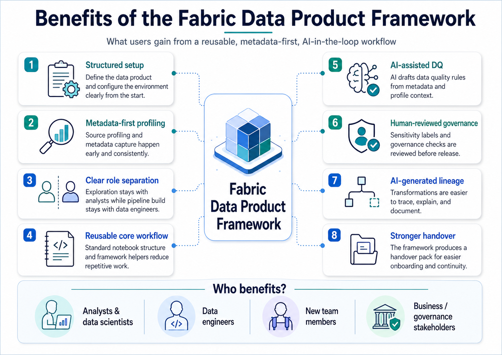
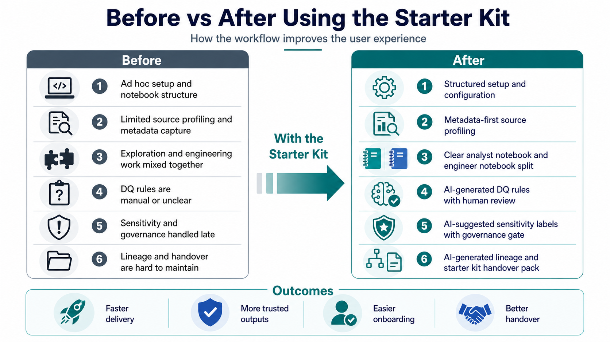
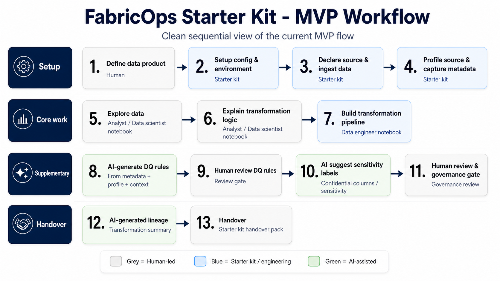

# Fabric Data Product Framework

A structured workflow for turning notebook-based data work into reliable, reusable, and handover-ready Fabric data products.

Framework documentation: https://voycepeh.github.io/fabric-data-product-framework/  

Function reference: https://voycepeh.github.io/fabric-data-product-framework/reference/

## What this framework sets out to do?

Most notebook pipelines start as one-off analysis work. Over time, they become difficult to rerun, review, govern, and hand over.

The Fabric Data Product Framework gives notebook-based data work a standard delivery path.

It helps teams define the data contract clearly, profile and store metadata early, separate exploration from engineering, generate data quality rules with AI support, apply confidentiality and governance checks before release, and produce lineage, documentation, and handover materials as part of the workflow.

The outcome is faster delivery, more trusted outputs, easier onboarding, and better continuity when another person takes over.

### What users get

### Before vs after

### End to end flow

## What problems it aims to solve?

| Problem | Framework response |
|---|---|
| Repetitive notebook setup and Fabric path handling | Reusable runtime/config and notebook workflow structure. |
| Profiling results are not reusable metadata | Profiling artifacts are captured as reusable metadata outputs. |
| Manual DQ rule writing is slow | AI-assisted and deterministic DQ candidate generation with human approval. |
| Schema drift, data drift, and incremental refresh risk | Drift/safety checks are integrated into the data product path. |
| Governance and sensitivity review are disconnected from execution | Governance suggestions and approval artifacts are included in the same workflow. |
| Handover is hard when logic lives only in notebooks | Lineage, run summaries, and handover pack artifacts are assembled for transfer. |

## DQX-inspired, Fabric-native
This framework takes inspiration from [Databricks Labs DQX](https://databrickslabs.github.io/dqx/docs/guide/ai_assisted_quality_checks_generation/) patterns (profiling, quality rule generation, quality check storage, check execution, and quarantine/summary metrics).

This repository adapts that pattern to Microsoft Fabric notebooks, Lakehouse/Warehouse, Fabric AI functions, and Copilot-style workflows.

## How does AI comes into play?
AI helps draft DQ rules, sensitivity labels, lineage, transformation summaries, and handover notes.
We do it via creating functions within this framework that allow us to prompt the native [AI function](https://learn.microsoft.com/en-us/fabric/data-science/ai-functions/overview?tabs=pandas-pyspark%2Cpandas) or standardize prompts that we manually generate and paste into copilot.

### Microsoft Fabric AI Functions prerequisites
Fabric AI Functions are used as an optional AI in the loop layer for generating candidate metadata, quality rules, governance suggestions, and handover summaries from profiling evidence. They are not required for the deterministic core pipeline to run.

Requirements:
- Fabric Runtime 1.3 or later.
- Paid Fabric capacity F2 or higher, or P capacity.
- Tenant switch for Copilot / Azure OpenAI powered features enabled.
- See Microsoft Learn: [AI Functions overview](https://learn.microsoft.com/en-us/fabric/data-science/ai-functions/overview).

Dependency notes (runtime and DataFrame-type dependent):
- Pandas with Python runtime: install `synapseml_internal` and `synapseml_core` wheel dependencies plus `openai`.
- Pandas with PySpark runtime: install `openai`.
- PySpark DataFrame with PySpark runtime: no installation required.

Use the Microsoft Learn installation commands for your environment rather than pinning local versions unless Microsoft documentation requires specific versions.
