# Fabric Data Product Framework

## What this is
A reusable Microsoft Fabric notebook framework for turning raw or source data into governed, quality-checked, handover-ready data products.

It abstracts the repeatable 80% of pipeline work so teams can focus on the dataset-specific 20%: business meaning, transformation logic, and data nuance.

## Why this exists
This framework is designed to make Fabric data products easier to:
- build
- review
- govern
- operate
- hand over
- make AI-ready

It is intended for teams building governed and AI-ready Microsoft Fabric data products, where pipeline logic, metadata, data quality, contracts, lineage, and handover context need to be repeatable rather than rebuilt from scratch for every dataset.

## Operating model

The framework uses three execution lanes.

| Lane | Responsibility |
|---|---|
| Outside Fabric | Prepare the business and supporting context needed before the notebook can run: purpose, steward, approved usage, definitions, caveats, supporting files, mapping tables, reference data, and governance expectations. |
| Inside Fabric: Human-guided | Configure and review the data product inside Fabric notebooks: notebook setup, source declaration, EDA, transformation logic, DQ rule approval, exception review, and handover review. |
| Inside Fabric: Framework-run | Run repeatable framework logic: profiling, metadata logging, drift checks, incremental safety checks, DQ execution, contract validation, technical columns, write pattern, lineage, run summary, and metadata outputs. |

AI is not a separate owner. It is used as assistance inside the workflow.

Some human-guided and framework-run steps can be AI-assisted through Copilot or Fabric AI functions, but AI output must be reviewed before becoming part of the pipeline.

AI proposes. Humans approve. The framework validates and records.

## Lifecycle at a glance

| Step | Stage | Lane | Notes |
|---:|---|---|---|
| 1 | Purpose, steward, usage, and caveats | Outside Fabric | Business agreement and context before build |
| 2 | Supporting data and metadata preparation | Outside Fabric | Mapping files, reference data, manual metadata, governance expectations |
| 3 | Notebook setup and runtime parameters | Inside Fabric: Human-guided | Configure environment, source, target, flags |
| 4 | Source declaration | Inside Fabric: Human-guided | Declare source tables/files and expected grain |
| 5 | Source profiling and metadata logging | Inside Fabric: Framework-run | Framework profiles source and records metadata |
| 6 | Schema drift, data drift, and incremental safety | Inside Fabric: Framework-run | Framework blocks unsafe changes where configured |
| 7 | EDA notes and data nuance explanation | Inside Fabric: Human-guided | Human interprets profile, captures caveats; may use AI assistance |
| 8 | Transformation logic | Inside Fabric: Human-guided | Dataset-specific transformation logic |
| 9 | Technical columns and write pattern | Inside Fabric: Framework-run | Add audit fields, hashes, timestamps, standard write behavior |
| 10 | Output profiling | Inside Fabric: Framework-run | Framework profiles output and records metadata |
| 11 | DQ rules and runtime contract validation | Inside Fabric: Framework-run + Human-guided | Framework executes; human approves rules and reviews exceptions |
| 12 | Lineage and transformation summary | Inside Fabric: Framework-run + Human-guided | Framework records lineage; AI may draft summaries; human reviews |
| 13 | Run summary, AI context, and handover package | Inside Fabric: Framework-run + Human-guided | Framework exports; human accepts handover |

## Lifecycle flow

```mermaid
flowchart LR
    subgraph OUT["Outside Fabric"]
        O1["Business agreement"]
        O2["Approved usage, steward, definitions, caveats"]
        O3["Supporting files, mapping tables, reference data"]
        O4["Metadata collection and governance expectations"]
    end

    subgraph HUMAN["Inside Fabric: Human-guided"]
        H1["Notebook setup and runtime parameters"]
        H2["Source declaration"]
        H3["EDA and data nuance explanation"]
        H4["Transformation logic"]
        H5["DQ rule approval and exception review"]
        H6["Handover review"]
    end

    subgraph FRAMEWORK["Inside Fabric: Framework-run"]
        F1["Naming and runtime checks"]
        F2["Source profiling and metadata logging"]
        F3["Schema drift, data drift, incremental safety"]
        F4["DQ execution and contract validation"]
        F5["Technical columns and write pattern"]
        F6["Output profiling, lineage, run summary, metadata logs"]
    end

    OUT --> HUMAN
    HUMAN --> FRAMEWORK
    FRAMEWORK --> HUMAN
    HUMAN --> OUT

    AI["AI-assisted where useful:<br/>Copilot prompts or Fabric AI functions<br/>AI proposes, humans approve, framework records"]
    AI -.-> HUMAN
    AI -.-> FRAMEWORK
```

## Quick start
1. Define purpose, steward, usage, and business metadata.
2. Prepare supporting files, reference data, and governance expectations.
3. Configure notebook parameters and declared sources.
4. Run source profiling and metadata logging.
5. Complete EDA notes and human review.
6. Build transformation logic and run framework checks.
7. Review DQ outcomes and contract validation.
8. Export lineage, run summary, AI context, and handover package.

See [docs/quick-start.md](docs/quick-start.md) for runnable examples and setup details.

## More documentation
- [Lifecycle operating model](docs/lifecycle-operating-model.md)
- [Notebook structure](docs/notebook-structure.md)
- [AI-assisted steps](docs/ai-in-the-loop.md)
- [Handover package](docs/handover-package.md)
- [Framework status (implemented vs planned)](docs/framework-status.md)
- [Execution engine model](docs/engine-model.md)
- [Public repo safety guidance](docs/public-repo-safety.md)
- [Lineage recorder](docs/lineage.md)
- [Fabric smoke test](docs/fabric-smoke-test.md)
- [Contract enforcement](docs/contract-enforcement.md)
- [Run summary](docs/run-summary.md)
- [Callable API reference](src/README.md)

## Callable Function Reference
See [src/README.md](src/README.md) for callable API references.
