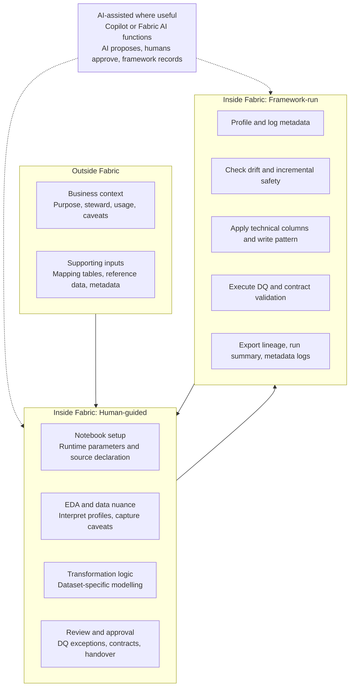

# Fabric Data Product Framework

A Microsoft Fabric-first framework for building governed, quality-checked, drift-aware, contract-validated, handover-ready, AI-ready data products in Fabric notebooks.

## What this framework is
This repository provides a reusable notebook framework and supporting documentation for teams that want consistent delivery controls in Microsoft Fabric: contracts, drift checks, DQ checks, lineage, run summaries, and handover outputs.

## Why it exists
Many data products repeat the same control-plane work for every dataset. This framework standardizes that repeatable work so practitioners can focus on dataset-specific decisions and business interpretation.

## Who it is for
- Python-proficient data practitioners working in Microsoft Fabric notebooks.
- Teams that need governed, explainable, handover-ready outputs.
- Teams that want AI assistance without removing human accountability.

## Three-lane operating model
| Lane | Core responsibility |
|---|---|
| Outside Fabric | Prepare business and supporting context before notebook runtime. |
| Inside Fabric: Human-guided | Configure, interpret, transform, approve, and review in the notebook. |
| Inside Fabric: Framework-run | Execute deterministic checks, metadata logging, gates, write patterns, lineage, run summary, and handover outputs. |

### Outside Fabric: what must be prepared
- Purpose, steward, approved usage, caveats.
- Supporting files, mapping tables, reference data.
- Metadata and governance expectations.

### Inside Fabric: Human-guided
- Dataset contract inputs and runtime parameters.
- Source declaration, EDA interpretation, data nuance explanation.
- Transformation logic.
- DQ exception review, approval decisions, handover review.

### Inside Fabric: Framework-run
- Source/output profiling and metadata logging.
- Schema drift, data drift, and incremental safety checks.
- Contract validation, DQ execution, technical columns, standard write behavior.
- Lineage capture, run summary, and handover artifacts.

## Where AI fits
AI is an assistance tag, not a standalone accountable actor.
- Copilot prompts inside Fabric notebooks.
- Fabric AI functions or notebook-level AI calls using structured context.
- AI-assisted suggestions for DQ rules, metadata labels, lineage summaries, transformation explanations, and handover notes.

**Boundary:** AI proposes. Humans approve. The framework validates and records.

## Lane handoff overview
The diagram shows the lane handoff only. The detailed lifecycle is described in [docs/lifecycle-operating-model.md](docs/lifecycle-operating-model.md).

## Current capability status
See [docs/capability-status.md](docs/capability-status.md).

## How to test locally
See [docs/local-smoke-test.md](docs/local-smoke-test.md).

## How to test minimally in Fabric
See [docs/fabric-smoke-test.md](docs/fabric-smoke-test.md).

## Documentation map
- [Getting started](docs/getting-started.md)
- [Lifecycle operating model](docs/lifecycle-operating-model.md)
- [Capability status](docs/capability-status.md)
- [Local smoke test](docs/local-smoke-test.md)
- [Fabric smoke test](docs/fabric-smoke-test.md)
- [Notebook structure](docs/notebook-structure.md)
- [Engine model](docs/engine-model.md)
- [Contract enforcement](docs/contract-enforcement.md)
- [Run summary](docs/run-summary.md)
- [Lineage](docs/lineage.md)
- [Public repo safety](docs/public-repo-safety.md)
- [AI workflow: generated DQ rules](docs/workflows/ai-generated-dq-rules.md)
- [AI workflow: transformation summary](docs/workflows/ai-transformation-summary.md)
- [Callable function reference](src/README.md)

## Callable Function Reference
See [src/README.md](src/README.md) for callable APIs and usage examples.
