# Fabric Data Product Framework

**Tagline:** Data First before AI First

A reusable Microsoft Fabric notebook framework for building documented, governed, quality-checked, drift-aware, AI-ready data products.

## Why this exists

Data teams often rebuild the same notebook patterns for profiling, quality checks, drift monitoring, governance notes, and lineage handoffs. This framework provides a consistent starting point so teams can focus on dataset-specific logic and business meaning instead of reinventing operational scaffolding.

## Who this is for

- Python-proficient data engineers, analytics engineers, and data scientists working in Microsoft Fabric
- Teams standardizing notebook-based data product delivery
- Organizations that want governed, explainable, and reusable dataset pipelines

## What problem it solves

- Reduces repeated engineering effort across dataset pipelines
- Introduces a shared lifecycle from source declaration to run summary
- Improves traceability with structured metadata outputs
- Supports AI-readiness with curated context export after human-reviewed runs

## What the framework standardizes

- Notebook section structure and execution flow
- Dataset contract configuration patterns (YAML)
- Profiling, drift, and quality metadata outputs
- Governance and lineage logging conventions
- Run summaries and AI context packaging

## Product positioning

- **Data First before AI First**
- **GitHub is the source of truth**
- **Fabric is the execution environment**
- **Not** a full data catalog
- **Not** a replacement for Microsoft Purview
- **Not** only a data quality library
- A reusable notebook framework for turning pipelines into trusted data products

## What the framework is trying to do

```mermaid
flowchart LR
    A[Define dataset purpose and ownership] --> B[Run notebook lifecycle in Fabric]
    B --> C[Profile sources and check drift/safety]
    C --> D[Apply transformations + technical columns]
    D --> E[Profile outputs and run quality checks]
    E --> F[Apply governance labels and contracts]
    F --> G[Write lineage + run summary metadata]
    G --> H[Export AI-ready context for assisted documentation]
    H --> I[Human review and approval]
```

## What belongs in GitHub vs what belongs in Fabric

### GitHub (source of truth)

- Framework code and reusable package modules
- Notebook templates and documentation
- Dataset contracts and configuration examples
- Tests, CI definitions, and release history

### Fabric (execution environment)

- Notebook execution, scheduling, and orchestration
- Lakehouse reads/writes and runtime outputs
- Metadata table persistence for runs, drift, quality, and lineage
- Workspace-level operational monitoring

## Core lifecycle

1. Dataset purpose and steward agreement
2. Notebook parameters and environment setup
3. Source declaration
4. Source profiling
5. Schema drift, data drift, and incremental safety checks
6. EDA notes and data nuance explanation
7. Transformation pipeline
8. Technical columns and write pattern
9. Output profiling
10. Data quality rules
11. Governance labeling
12. Data contracts
13. Lineage and transformation summary
14. Run summary and AI context export

## Repository status

This repository is in an **early scaffold** stage. The initial focus is product direction, standards, and safe public templates. Core execution engines are intentionally not implemented yet.

## Public repo safety note

Do not commit real organisational data, secrets, tenant information, internal table names, production metadata, real workspace names, or screenshots containing sensitive details.
