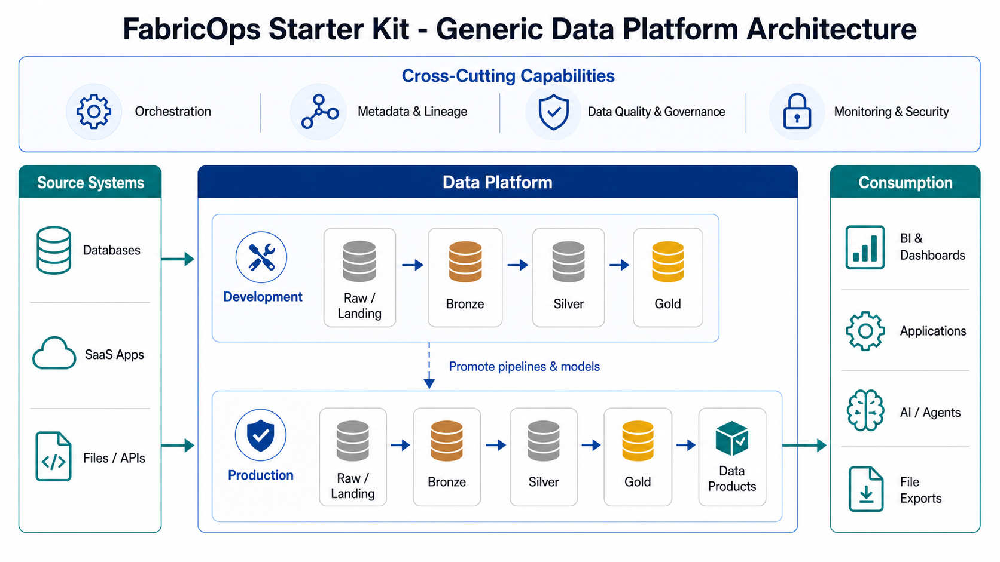

# FabricOps Starter Kit

A practical starter kit for building governed, quality-checked, AI-ready notebooks in Microsoft Fabric.

Documentation: https://voycepeh.github.io/FabricOps-Starter-Kit/

## Start here

- [Quick Start](https://voycepeh.github.io/FabricOps-Starter-Kit/quick-start/)
- [Lifecycle Operating Model](https://voycepeh.github.io/FabricOps-Starter-Kit/lifecycle-operating-model/)
- [Architecture](https://voycepeh.github.io/FabricOps-Starter-Kit/architecture/)
- [Notebook Structure](https://voycepeh.github.io/FabricOps-Starter-Kit/notebook-structure/)
- [Metadata and Contracts](https://voycepeh.github.io/FabricOps-Starter-Kit/metadata-and-contracts/)
- [Function Reference](https://voycepeh.github.io/FabricOps-Starter-Kit/reference/)
- [Fabric Wheel Install](https://voycepeh.github.io/FabricOps-Starter-Kit/setup/fabric-wheel-install/)

## Why this starter kit exists

Fabric notebooks often begin as analysis work and then become recurring operations. This starter kit gives that transition a reusable structure for configuration, checks, governance review, lineage, and handover.

Read more: [Quick Start](https://voycepeh.github.io/FabricOps-Starter-Kit/quick-start/) · [Lifecycle Operating Model](https://voycepeh.github.io/FabricOps-Starter-Kit/lifecycle-operating-model/)

## Design choices

### Fabric-first

FabricOps Starter Kit is inspired by open data contracts, DQX-style data quality checks, metadata registries, and lineage patterns, but adapts those ideas to Microsoft Fabric realities.

In Fabric, teams must operate across Lakehouses, Warehouses, OneLake paths, workspace separation, dev-to-prod promotion, and cross-store or cross-workspace movement that often needs explicit notebook code.

### Notebook-first

Many Fabric data products begin as notebooks. This kit does not try to replace notebooks with a full orchestration, governance, or data platform product; it makes notebooks more repeatable, reviewable, and handover-ready.

The model separates exploration notebooks that capture profiling, reasoning, and AI-assisted suggestions from pipeline notebooks that enforce approved logic, quality checks, classifications, and output contracts.

### Contract-first and metadata-first

Contracts are not standalone documents only. In this kit, contracts connect to notebook naming, approved usage, schema expectations, data quality rules, sensitivity review, metadata profiling, and output registration.

This pattern is inspired by open data contract approaches, adapted to Fabric-native storage and execution.

### DQX-inspired, Fabric-native quality checks

The quality-check model is inspired by DQX-style reusable rule definitions and rule application, but implemented for Fabric notebooks, Spark DataFrames, and metadata tables.

AI may help suggest rules, humans approve them, and pipeline notebooks enforce them.

### AI-in-the-loop

AI helps with repeated governance and engineering work such as metadata summaries, DQ rule suggestions, sensitivity classification suggestions, lineage drafting, and handover notes.

AI does not replace approval. Governance owners, data stewards, and engineers remain responsible for approved usage, classifications, quality rules, and production release decisions.

### Handover-first

The goal is not only to make one notebook run. The goal is to make the data product understandable to the next engineer, analyst, reviewer, or owner.

## What users get

Teams get reusable patterns for profiling, quality checks, sensitivity review, lineage, metadata logging, and handover so these controls do not have to be rebuilt in every notebook.

Read more: [Function Reference](https://voycepeh.github.io/FabricOps-Starter-Kit/reference/) · [Metadata and Contracts](https://voycepeh.github.io/FabricOps-Starter-Kit/metadata-and-contracts/)

## How it fits into a Fabric data platform

The kit supports repeatable notebook execution across development and production patterns, with explicit handling for cross-store and cross-workspace data flows.

Read more: [Architecture](https://voycepeh.github.io/FabricOps-Starter-Kit/architecture/)

## Notebook operating model

The notebook model keeps shared runtime context clear: one environment config can support many agreements and notebooks, and one agreement can branch into multiple notebook paths.

Read more: [Notebook Structure](https://voycepeh.github.io/FabricOps-Starter-Kit/notebook-structure/)

## Canonical lifecycle workflow

The project follows a canonical 10-step lifecycle: governance-first, controlled engineering execution, then optional AI-assisted drafting and summarization.

Read more: [Lifecycle Operating Model](https://voycepeh.github.io/FabricOps-Starter-Kit/lifecycle-operating-model/)

## What problems it aims to solve

- Repetitive notebook setup and path handling.
- Non-reusable profiling and validation outputs.
- Slow, manual quality/governance drafting and review loops.
- Weak lineage and handover evidence for operational ownership transfer.

These patterns are inspired by open data contracts and DQX, but intentionally adapted to Fabric. For contract behavior and storage, see [Metadata and Contracts](https://voycepeh.github.io/FabricOps-Starter-Kit/metadata-and-contracts/). For Fabric-native DQ architecture, see [Architecture > Fabric-native Data Quality](https://voycepeh.github.io/FabricOps-Starter-Kit/architecture/dqx-inspired-fabric-native-dq/).

## AI in the loop

AI assists with metadata summaries, data quality rule suggestions, sensitivity classification suggestions, lineage, and handover notes.
Humans approve governance and quality decisions.
Pipeline notebooks enforce approved decisions.

## Scope

This is a Fabric-first notebook starter kit.
It is not a full data platform, orchestration system, or governance product.
