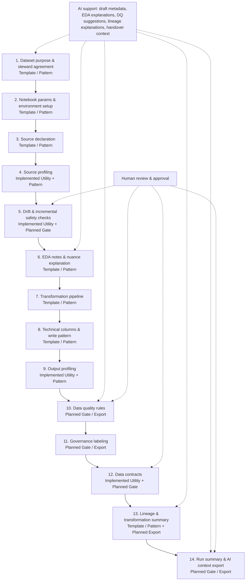

# Fabric Data Product Framework

A reusable Microsoft Fabric notebook framework for turning raw data into documented, quality-checked, governed, AI-ready data products.

## What this framework is for

This framework helps Python-proficient data practitioners deliver consistent Fabric data products without first mastering every Fabric engineering best practice. It provides a practical notebook lifecycle, reusable templates, and metadata outputs that support onboarding, review, and handover.

## Core idea

**AI proposes. Humans approve. Pipelines enforce. Documentation updates automatically.**

## Core lifecycle

Use this lifecycle as the default operating model for each dataset.

| Step | Lifecycle stage | Purpose | Current support |
|---|---|---|---|
| 1 | Dataset purpose and steward agreement | Define business purpose, scope, steward, and expected usage. | Notebook template section; human-authored, AI-assisted. |
| 2 | Notebook parameters and environment setup | Set runtime parameters, paths, target tables, and execution mode. | Fabric notebook setup pattern with parameters, paths, runtime imports, and naming convention check. |
| 3 | Source declaration | Register declared sources, keys, refresh expectations, and ingestion intent. | Source table and lakehouse variables; source registry is planned. |
| 4 | Source profiling | Profile input shape, nulls, distributions, and basic quality indicators. | Implemented profiling utility and Fabric metadata logging pattern. |
| 5 | Schema drift, data drift, and incremental safety checks | Compare current vs baseline structure and behavior before transforms; verify incremental boundaries. | Schema drift and incremental safety utilities implemented. Data drift checks planned. |
| 6 | EDA notes and data nuance explanation | Capture observed quirks, caveats, and business-relevant interpretation notes. | Notebook documentation pattern. Findings are frozen after development so they do not become recurring pipeline logic. |
| 7 | Transformation pipeline | Apply business logic from raw/bronze to curated outputs with reproducible steps. | Notebook section pattern for dataset-specific business logic designed to run end-to-end. |
| 8 | Technical columns and write pattern | Apply audit columns, watermark/version columns, partition/write rules, and persistence pattern. | Fabric notebook pattern for audit columns, datetime standardization, and lakehouse writes. |
| 9 | Output profiling | Re-profile final output to confirm expected shape and characteristics. | Implemented profiling utility and Fabric output metadata logging pattern. |
| 10 | Data quality rules | Run required checks (completeness, validity, consistency, thresholds) and capture pass/fail details. | Planned rule execution and pipeline gate. |
| 11 | Governance labeling | Apply sensitivity/classification labels and usage controls in documented form. | Planned governance metadata and label validation. |
| 12 | Data contracts | Validate and publish dataset contract expectations for schema, semantics, and constraints. | Contract schema validation implemented. Runtime enforcement planned. |
| 13 | Lineage and transformation summary | Record lineage and summarize how each output is derived. | AI-assisted lineage prompt/template proven. Automated extraction planned. |
| 14 | Run summary and AI context export | Produce run summary and package curated context for assisted documentation and handover. | Planned handover package. |



## What the framework currently standardizes or supports

### Implemented in this repo

1. Dataset contract schema validation
2. DataFrame profiling utility
3. Schema snapshot and schema drift comparison
4. Engine-aware dataframe API pattern for pandas, Spark, and auto mode
5. Safe public examples and documentation structure

### Proven in the Fabric notebook pattern

1. Dataset purpose and approved usage section
2. Notebook parameters and environment setup
3. Naming convention check
4. Source table declaration
5. Source profiling written to metadata table
6. EDA notes and frozen data nuance explanation
7. Core transformation section designed for run-all execution
8. Technical audit columns
9. Datetime standardization such as timezone conversion, date, time, and time block columns
10. Lakehouse write pattern
11. Output profiling written to metadata table
12. AI-assisted lineage prompt/template

### Planned next

1. Data drift checks
2. Incremental partition safety checks
3. Data quality rule execution
4. Governance labeling checks
5. Runtime data contract enforcement
6. Automated lineage summary
7. Run summary
8. AI context export

## What belongs in GitHub vs Fabric

### GitHub (source of truth)

- Templates and reusable framework code
- Contracts, examples, tests, and documentation
- Review history and change control

### Fabric (execution environment)

- Notebook and pipeline execution
- Lakehouse reads/writes and operational runs
- Metadata tables, monitoring, and runtime outputs

## Repository status

This repository is in an **early scaffold** stage. The current focus is standards, lifecycle consistency, and safe public templates.

## Public repo safety note

Do not commit real organisational data, secrets, tenant details, internal table names, workspace names, screenshots, or production metadata.

## Short examples

For deeper examples, see [docs/architecture.md](docs/architecture.md), [docs/schema-drift.md](docs/schema-drift.md), and [docs/metadata-model.md](docs/metadata-model.md).

### Contract validation

```python
from fabric_data_product_framework.config import load_and_validate_dataset_contract

contract, errors = load_and_validate_dataset_contract(
    "examples/configs/sample_dataset_contract.yaml"
)
```

### DataFrame profiling

```python
import pandas as pd
from fabric_data_product_framework.profiling import (
    flatten_profile_for_metadata,
    profile_dataframe,
)

df = pd.DataFrame({"customer_id": [1, 2, 3], "amount": [10.5, 20.0, 30.0]})
profile = profile_dataframe(df, dataset_name="synthetic_orders")

source_profile = profile_dataframe(df_source, dataset_name="synthetic_orders", engine="spark")
profile_rows = flatten_profile_for_metadata(
    source_profile,
    table_name="source.synthetic_orders",
    run_id=ctx["run_id"],
    table_stage="source",
)
```


### Technical columns

```python
from fabric_data_product_framework.technical_columns import add_standard_technical_columns

df_output = add_standard_technical_columns(
    df_output,
    run_id=ctx["run_id"],
    environment=ctx["environment"],
    source_table=ctx["source_table"],
    watermark_column="updated_at",
    business_keys=["customer_id"],
    engine="spark",
)
```

### Schema drift check

```python
from fabric_data_product_framework.drift import compare_schema_snapshots

result = compare_schema_snapshots(baseline_snapshot, current_snapshot)
```

### Incremental safety check

```python
from fabric_data_product_framework.incremental import (
    assert_incremental_safe,
    build_partition_snapshot,
    compare_partition_snapshots,
)

current_partition_snapshots = build_partition_snapshot(
    df_source,
    dataset_name="synthetic_orders",
    table_name="source.synthetic_orders",
    partition_column="business_date",
    business_keys=["customer_id", "order_id"],
    watermark_column="updated_at",
    engine="spark",
)

safety_result = compare_partition_snapshots(
    previous_partition_snapshots,
    current_partition_snapshots,
)

assert_incremental_safe(safety_result)
```

### Notebook runtime helper

```python
from fabric_data_product_framework.runtime import (
    build_runtime_context,
    assert_notebook_name_valid,
)

ctx = build_runtime_context(
    dataset_name="synthetic_orders",
    environment="dev",
    source_table="source.synthetic_orders",
    target_table="product.synthetic_orders",
    notebook_name="source_to_product_synthetic_orders",
)

assert_notebook_name_valid(
    ctx["notebook_name"],
    allowed_prefixes=["source_to_product_", "bronze_to_silver_", "silver_to_gold_"],
)
```

## Execution engines

The framework exposes engine-aware dataframe APIs with `engine="auto" | "pandas" | "spark"`.

- **pandas**: local and synthetic workloads
- **spark**: Fabric/lakehouse-scale workloads
- **auto**: runtime engine detection

See [docs/engine-model.md](docs/engine-model.md) for engine behavior and API usage.

## First runnable notebook MVP

After PR 14, you can copy `templates/notebooks/fabric_data_product_mvp.py` into a Fabric notebook to run a full MVP flow from contract validation to metadata outputs.

Wire only three adapters to start testing in your environment:

- `fabric_reader`
- `fabric_table_writer`
- `metadata_writer`

The template is intentionally adapter-based and does not depend on a specific workspace setup or Fabric-only SDK imports.
