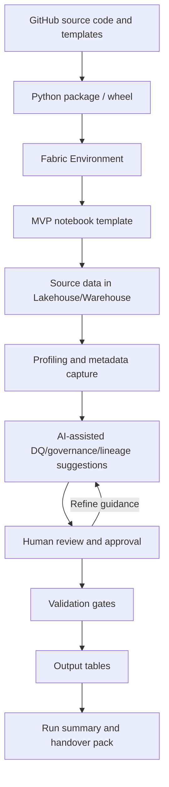

# Architecture Overview

## Core architecture in plain language

FabricOps Starter Kit operates as a notebook-driven operating flow:

1. **GitHub source code and templates** define the reusable starter-kit patterns and starter notebook assets.
2. A **Python package / wheel** packages reusable starter-kit capabilities.
3. The package is installed into a **Fabric Environment**.
4. A practitioner runs the **MVP notebook template** in Fabric.
5. The notebook reads **source data in Lakehouse/Warehouse**.
6. The starter kit performs **profiling and metadata capture**.
7. **AI-assisted suggestions** are generated for DQ rules, governance labels, lineage notes, and run summaries.
8. A **human review and approval** step confirms business meaning, governance, and release suitability.
9. **Validation gates** enforce data product expectations.
10. Approved runs write **output tables**.
11. The starter kit produces a **run summary and handover pack** for downstream ownership.

## Actor responsibilities

| Actor | Primary responsibilities |
|---|---|
| Technical practitioner | Configuration, source declaration, transformations, and run validation in Fabric notebooks. |
| Functional/business owner | Business purpose confirmation, approved usage context, business rule decisions, and data sensitivity review. |
| AI/Copilot | Proposes DQ rules, governance labels, lineage notes, summaries, and handover notes from structured metadata. |
| Starter kit | Executes reusable checks, logging, metadata capture, validation gates, and packaging helpers. |
| Fabric | Runs notebooks, hosts environments, and persists outputs and metadata assets. |

## System flow

## Metadata architecture

Metadata tables are the operational memory of the notebook-driven data operations outcome. They preserve what happened during a run and provide evidence for support, auditability, and handover.

The metadata model captures:

- source profiles
- output profiles
- schema drift results
- data drift and partition checks
- DQ rules and DQ results
- governance labels
- lineage records
- transformation summaries
- run summaries and handover exports
