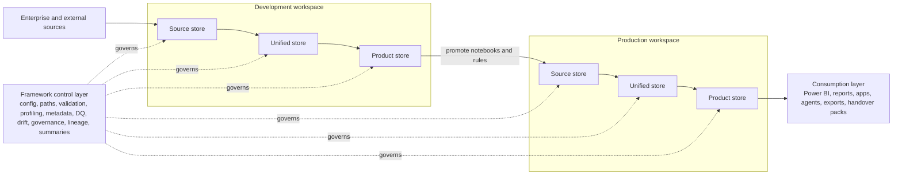

# FabricOps operating architecture

## Why this architecture exists

FabricOps Starter Kit supports an end to end workflow in Microsoft Fabric where teams move data from source systems to governed, consumption-ready outputs.

In practice, Fabric projects often read from and write to multiple lakehouses, warehouses, files, workspaces, and environments. A Fabric notebook usually runs with one default attached item, so reusable configuration and path resolution helpers are needed to make cross-store and cross-environment data movement reliable and repeatable.

## End to end operating workflow

The architecture is organized as a practical operating workflow across four layers.

### 1) Source layer

The source layer is where upstream data is landed or accessed. Typical inputs include:

- enterprise lakehouses
- warehouses
- files and object storage
- APIs
- SharePoint
- manual file drops
- other external or internal upstream systems

### 2) Development workspace

Development is where notebooks, rules, profiling, and transformations are tested before release.

It is organized into three practical stores:

- **Source store**: land or read source-aligned data with minimal business transformation.
- **Unified store**: clean, standardize, profile, validate, and apply reusable business logic.
- **Product store**: publish consumption-ready development outputs for validation and user testing.

### 3) Production workspace

Production is where stable pipelines run on schedule with governance, validation, and operational controls.

It uses the same three-store pattern for consistency:

- **Source store**
- **Unified store**
- **Product store**

Production outputs can become future inputs for downstream workflows, but development stores are not treated as permanent production data locations.

### 4) Consumption layer

Consumption uses production-ready outputs through:

- Power BI semantic models, dashboards, and reports
- downstream applications and agents
- exports and integration feeds
- handover packs for support and ownership transition

## Framework control layer

Across all layers, the framework provides reusable controls so teams can run governed notebook operations consistently:

- runtime configuration
- path resolution across stores, workspaces, and environments
- notebook naming validation
- source and output profiling
- metadata capture for operational evidence
- AI-assisted DQ rule generation
- DQ validation and threshold enforcement
- schema drift checks
- data drift and partition checks
- governance metadata and usage context
- lineage notes and run traceability
- run summaries and handover outputs

These controls are the operating backbone of the workflow, not optional add-ons.

## Architecture diagram

## Where functions fit

Individual functions do not need separate architecture pages. The architecture remains one operating view, while function-level details stay in the reference documentation.

Function groups in this architecture are:

- **Runtime setup**: configuration loading, path resolution, notebook naming checks.
- **Data movement**: lakehouse and warehouse read/write helpers.
- **Profiling and metadata**: source/output profiling, metadata tables, run evidence capture.
- **Quality and drift**: DQ rule generation, DQ validation, schema drift, data drift, partition checks.
- **Governance**: sensitivity metadata, governance labels, approved usage context.
- **AI in the loop**: AI-generated rule suggestions, governance suggestions, lineage notes, and handover summaries, with human review before release.
- **Handover**: run summaries, lineage outputs, documentation artifacts, and support evidence.

## Deployment mechanics (supporting detail)

Packaging and deployment still matter, but they are implementation mechanics rather than the architecture itself:

1. source code is versioned in GitHub
2. reusable logic is packaged as a Python distribution
3. the package is installed into Fabric Environment(s)
4. notebooks run with environment-managed dependencies in development and production
