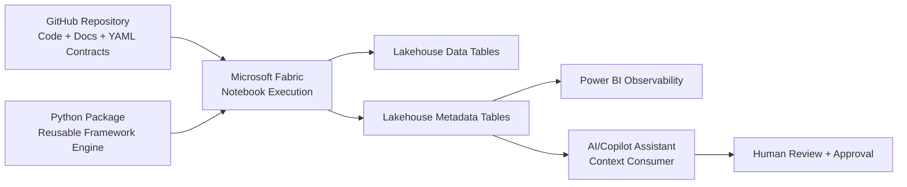
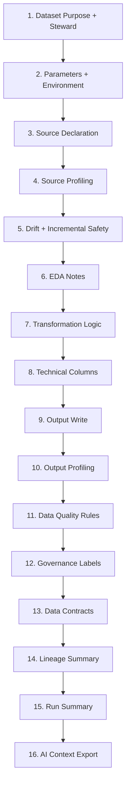
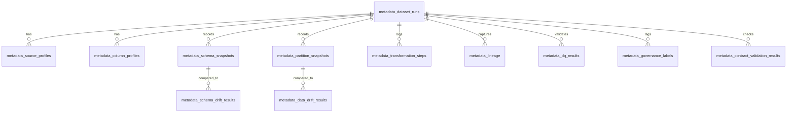

# Architecture Overview

## Core Architecture Positions

- **GitHub as source of truth:** code, configs, templates, docs, and version history live in GitHub.
- **Fabric as execution environment:** notebook runs, orchestration, and table writes happen in Fabric.
- **Lakehouse metadata tables as framework output:** profiling, drift, quality, lineage, and run summaries are persisted for observability.
- **Notebook template as practitioner interface:** teams use a standard notebook lifecycle with room for domain-specific logic.
- **YAML config as dataset contract:** declarative config defines expectations and controls.
- **Python package as reusable engine:** shared helpers eventually power common lifecycle steps.
- **Power BI as observability layer:** dashboards summarize run health and framework outputs.
- **AI/Copilot as assistant using exported context:** AI consumes structured run context; humans approve final outputs.

## High-level architecture

## Notebook lifecycle

## Metadata outputs

