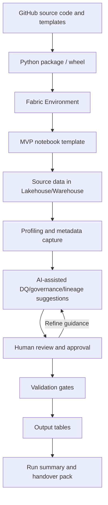

# Architecture Overview

## Purpose of this page

This page explains how the framework hangs together at system level: what each component does, why it exists, and how the pieces interact in Microsoft Fabric.

It does **not** duplicate run instructions.

- For the end-to-end execution sequence, use [Quick Start](quick-start.md).
- For callable function and code-level details, use [Function Reference](reference/SUMMARY.md).

## Core architecture in plain language

The framework runs as a connected flow:

1. **GitHub source code and templates** define the reusable framework patterns and starter notebook assets.
2. A **Python package / wheel** packages reusable framework capabilities.
3. The package is installed into a **Fabric Environment**.
4. A practitioner runs the **MVP notebook template** in Fabric.
5. The notebook reads **source data in Lakehouse/Warehouse**.
6. The framework performs **profiling and metadata capture**.
7. **AI-assisted suggestions** are generated for DQ rules, governance labels, lineage notes, and run summaries.
8. A **human review and approval** step confirms business meaning, governance, and release suitability.
9. **Validation gates** enforce data product expectations.
10. Approved runs write **output tables**.
11. The framework produces a **run summary and handover pack** for downstream ownership.

## Actor responsibilities

| Actor | Primary responsibilities |
|---|---|
| Technical practitioner | Configuration, source declaration, transformations, and run validation in Fabric notebooks. |
| Functional/business owner | Business purpose confirmation, approved usage context, business rule decisions, and data sensitivity review. |
| AI/Copilot | Proposes DQ rules, governance labels, lineage notes, summaries, and handover notes from structured metadata. |
| Framework | Executes reusable checks, logging, metadata capture, validation gates, and packaging helpers. |
| Fabric | Runs notebooks, hosts environments, and persists outputs and metadata assets. |

## System flow

## Metadata architecture

Metadata tables are the operational memory of the data product. They preserve what happened during a run and provide evidence for support, auditability, and handover.

The metadata model captures:

- source profiles
- output profiles
- schema drift results
- data drift and partition checks
- DQ rules and DQ results
- governance labels
- lineage records
- transformation summaries
- run summaries and handover exports

## Data product contract expectations

The framework treats the data product as having an explicit contract: expected source shape, freshness assumptions, quality rules, governance expectations, output targets, and handover evidence.

In this architecture, contracts are operating and validation expectations for the data product lifecycle, enforced through reusable checks and human approvals rather than a standalone module-first workflow.

## Relationship to Quick Start

Architecture explains **why the components exist and how they work together**.

Quick Start explains **the exact steps to run the MVP**.
