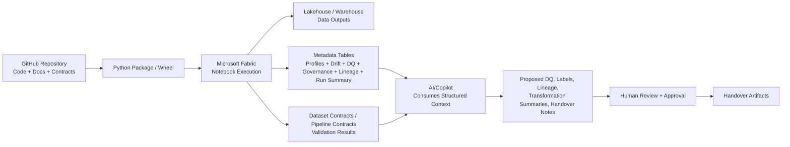
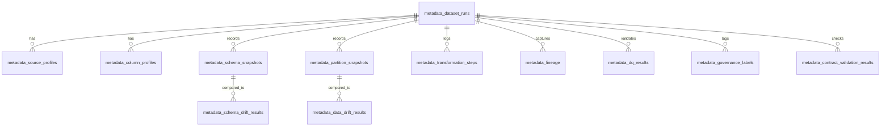

# Architecture Overview

This page describes framework components and runtime flow. For process sequencing, use the [canonical 13-step MVP lifecycle](lifecycle-operating-model.md).

## Core architecture positions

- **GitHub source of truth:** code, templates, contracts, docs, and version history are managed in GitHub.
- **Python package / wheel:** reusable framework utilities are packaged and installed into Fabric Environments.
- **Fabric notebook execution:** practitioners run the MVP notebook template with project-specific parameters.
- **Lakehouse / warehouse outputs:** transformed business outputs are written to target data stores.
- **Metadata tables:** profiling, drift, DQ, governance, lineage, and run summaries are persisted for observability and handover.
- **Dataset and pipeline contracts:** contract-first checks validate expected structure and operating rules.
- **AI/Copilot assistant:** AI consumes structured context and proposes DQ rules, labels, lineage, and documentation artifacts for human approval.

## System flow

## Metadata model reference

