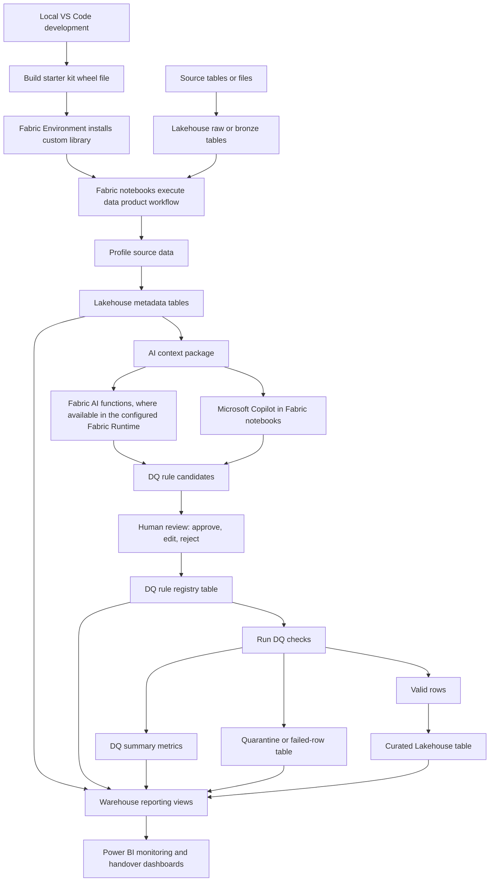

# Data quality architecture (DQX-inspired, Fabric-native)

## Why this architecture exists

FabricOps Starter Kit adopts the operating pattern popularized by Databricks Labs DQX while implementing it independently for Microsoft Fabric.

The reusable pattern is:

1. Profile source data.
2. Draft context-aware rules.
3. Persist candidate and approved rules.
4. Execute checks in pipeline runs.
5. Handle failed rows through quarantine/annotation outputs.
6. Capture summary metrics for monitoring and handover.

This project is **not** a DQX clone, fork, or replacement, and it does not vendor DQX code.

- DQX inspiration reference: <https://databrickslabs.github.io/dqx/docs/guide/>

## What is inspired vs. what is implemented here

### Inspired operating model

The architecture follows a repeatable quality lifecycle:

1. Profile source data.
2. Combine profiles with business and technical context.
3. Generate candidate quality rules.
4. Use AI assistance where appropriate.
5. Keep human approval as the control point.
6. Run approved rules in execution notebooks.
7. Capture failed rows and DQ metrics.
8. Publish SQL/BI-friendly monitoring views.

### Independent Fabric-native implementation

The implementation uses Fabric-native building blocks:

- Fabric notebooks for orchestration and enforcement.
- A local Python framework package distributed as a wheel.
- Fabric Environments for package installation and dependency pinning.
- Lakehouse tables for raw, curated, metadata, rules, results, and quarantine outputs.
- Warehouse-facing views/tables for SQL monitoring and Power BI consumption.
- Fabric AI functions (where available in the configured runtime) and Microsoft Copilot for AI-assisted steps.

## AI in the loop: suggestion, approval, enforcement

This architecture keeps AI acceleration and human accountability explicit:

- **AI suggests** DQ rules, classifications, summaries, and context packaging.
- **Humans approve** (edit/reject/accept) before rules are promoted.
- **Pipelines enforce** only approved rules during notebook execution.

This separation preserves governance accountability while still using AI to reduce manual effort.

## Why this is adapted for Microsoft Fabric

Fabric does not currently provide a one-for-one equivalent of Databricks Labs DQX. The architecture therefore implements the same lifecycle goals using Fabric-native runtime, storage, and governance controls.

## Responsibility layers

- **Execution layer:** notebooks run explicit orchestration.
- **Reusable logic layer:** the framework package provides validation, profiling, DQ helpers, drift checks, lineage, and run summaries.
- **Build/distribution layer:** teams develop in VS Code, run tests, build a wheel, and install it in Fabric Environments.
- **Persistence layer (Lakehouse):** stores raw/curated data, metadata, rules, results, quarantine, and run artifacts.
- **Consumption layer (Warehouse + Power BI):** provides SQL-friendly monitoring and governance visibility.
- **AI assistance layer:** Fabric AI functions and Copilot support drafting and summarization while humans retain approval control.

## Enterprise constraint for confidentiality-sensitive organizations

For organizations with strict confidentiality constraints, do not assume external internet access or external LLM endpoints. The supported AI path in this framework is Fabric-native AI functions and Microsoft Copilot under organizational controls.

## Architecture diagram

## How this evolves the original notebook template

Earlier notebook patterns often kept quality logic as manual sections inside individual notebooks (setup checks, profiling notes, transformation logic, output logging, and Copilot prompts). This architecture reframes that approach into a reusable operating model with:

1. persisted metadata,
2. a governed DQ rule lifecycle,
3. AI-assisted drafting and summarization,
4. explicit human approval checkpoints,
5. pipeline-based enforcement and monitoring outputs.
