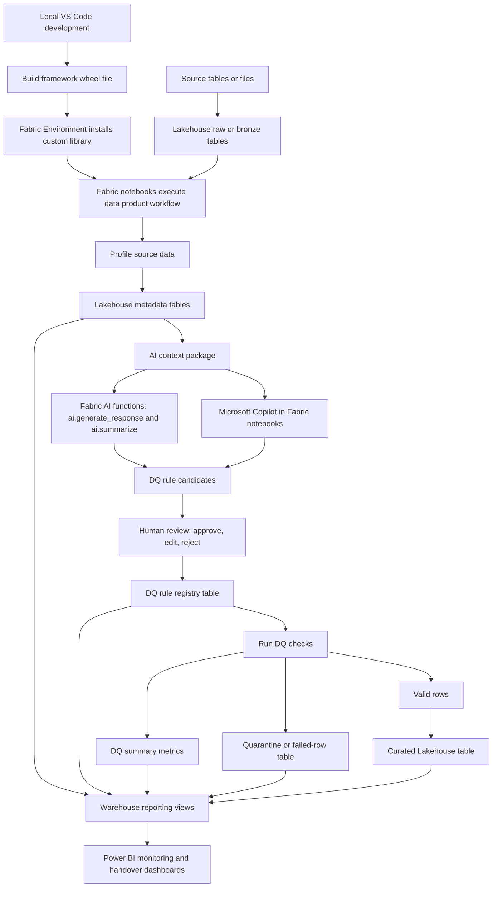

# DQX-inspired, Fabric-native data quality architecture

## Why this architecture exists

This framework takes **architectural inspiration** from Databricks Labs DQX, especially the repeatable operating pattern of:
1. profiling,
2. context-aware rule drafting,
3. rule persistence,
4. rule execution,
5. quarantine handling, and
6. summary metric capture.

At the same time, this project is **not** a DQX clone, fork, or replacement. It does not vendor or copy DQX code. The implementation is independent and Fabric-native.

- DQX inspiration reference: <https://databrickslabs.github.io/dqx/docs/guide/>

## What is inspired vs what is independently implemented

### Inspired pattern
This framework follows the same broad quality lifecycle:
1. Profile source data.
2. Combine profile output with metadata and business context.
3. Generate candidate quality rules.
4. Use AI-assisted generation where appropriate.
5. Store candidate and approved rules.
6. Run quality checks in notebook execution.
7. Route failed rows to quarantine/annotation outputs.
8. Store summary quality metrics centrally.
9. Monitor with SQL/BI reporting layers.
10. Keep human accountability for rule approval, governance labeling, and publish readiness.

### Independent Fabric-native implementation
The implementation uses Microsoft Fabric building blocks:
- Fabric notebooks for orchestration and execution.
- A local custom Python framework package built as a wheel (`.whl`).
- Fabric Environments to install and pin the framework and dependencies.
- Lakehouse tables for raw, curated, metadata, quality, and quarantine records.
- Warehouse-facing views/tables for SQL monitoring and Power BI.
- Fabric AI functions (`ai.generate_response`, `ai.summarize`) and Microsoft Copilot for approved AI-assisted steps.

## Why this is an adaptation for Microsoft Fabric

Microsoft Fabric does not currently provide a one-for-one equivalent of Databricks Labs DQX. This framework therefore adapts the same operating style using Fabric-native execution, storage, AI, and governance workflows.

## Architectural split of responsibilities

- **Execution layer:** Fabric notebooks run the workflow and keep orchestration explicit.
- **Reusable logic layer:** this framework package encapsulates contract validation, profiling, DQ helpers, drift checks, lineage, and run summaries.
- **Build/distribution layer:** developers work locally in VS Code, run tests, and build a wheel that is installed in Fabric Environments.
- **Persistence layer (Lakehouse):** stores Delta tables for raw/curated data, metadata, DQ rules/results, quarantine, and run artifacts.
- **Consumption layer (Warehouse + Power BI):** exposes SQL-friendly monitoring and governance views.
- **AI assistance layer:** Fabric AI functions and Copilot support drafting/summarization while keeping humans in control of enforcement decisions.

## Enterprise constraint for confidential-data organizations

In confidentiality-constrained organizations, do not assume external internet access or external LLM endpoints. The supported AI path in this framework is Microsoft Fabric-native AI functions and Microsoft Copilot, because these are organization-approved in-platform tools.

## Architecture diagram

