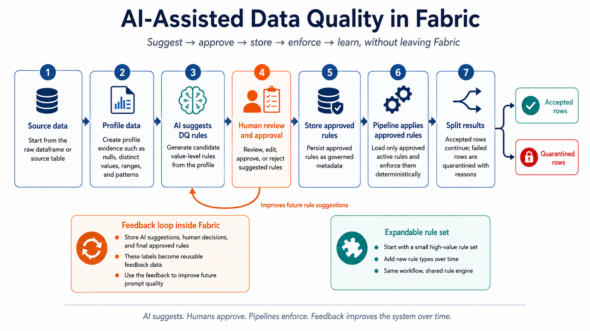

# AI-Assisted Data Quality

## Purpose

FabricOps uses an AI-in-the-loop workflow for data quality (DQ):

- AI suggests candidate rules from profiling evidence.
- Humans review and explicitly approve/reject each candidate.
- Metadata records those decisions as governed rule history.
- Pipeline notebooks enforce only approved, active rules deterministically.



## Run the example end to end

Want to try the workflow immediately? Import the example one-notebook demo into Fabric, install the matching `fabricops_kit` wheel, and run the full flow from profiling to approved-rule enforcement and quarantine handling.

- [Example one-notebook DQ demo](https://github.com/Voycepeh/FabricOps-Starter-Kit/blob/main/examples/notebooks/FabricOps_AI_DQ_Source_of_Truth_Widget_Metadata_Flow.ipynb)
- Matching wheel release: Coming with the tested release asset.

## 8-step workflow (exploration to analyst/engineer-approved enforcement)

| Step | Where | What happens | Output |
|---|---|---|---|
| 1. Source data or existing metadata | Input + metadata | Start from source data and/or existing metadata evidence. | Source dataframe / metadata evidence |
| 2. Load existing profile and active DQ rules if available | Exploration notebook (`02_ex`) | Inspect current profile rows and currently active approved DQ rules when present. | Reusable evidence context |
| 3. Profile or refresh only when needed | Exploration notebook (`02_ex`) | Refresh profile evidence only when metadata is missing/stale for the current question. | Current-enough profile evidence |
| 4. AI suggests candidate DQ rules | Exploration notebook (`02_ex`) | Use AI to suggest candidate value-level DQ rules from profile + business context. | Candidate rule suggestions |
| 5. Human DQ review | Analyst/engineer + DQ review widget in `02_ex` | Analyst/engineer reviews, edits, approves, or rejects candidates. | Reviewed decision rows |
| 6. Persist approved DQ metadata | Exploration notebook (`02_ex`) + metadata | Write approved rules to append-only DQ rule history metadata. | Approved DQ metadata |
| 7. Deterministic pipeline enforcement | Pipeline notebook (`03_pc`) | Load active approved rules and enforce them deterministically. | DQ evaluation result |
| 8. Optional rule deactivation workflow | DQ deactivation widget + metadata | Deactivate existing active rules with explicit `action_reason`; append inactive history rows. | Append-only inactive metadata rows |

Run evidence such as DQ results, quarantine counts, and rule history is persisted as metadata during enforcement, but it is not a separate step in the core rule workflow.

Use one shared metadata key across notebooks (for example `DQ_TABLE_NAME = TARGET_TABLE`) so exploration writes and pipeline enforcement reads the same governed rule set.

## Why start small?

FabricOps starts with a compact set of high-value value-level rules so the first workflow stays understandable and usable. The architecture is intentionally extensible: approved rules are stored as governed metadata and enforced through a shared rule engine, so additional rule types can be added later without changing the core suggest → approve → store → enforce workflow.

The approval history is useful beyond governance. Because the suggestions, decisions, and final approved rules are stored as metadata inside Fabric, they become reusable feedback data that can later improve prompts, evaluation, and future rule suggestions.

## Canonical config and real framework prompt

The workflow uses a single canonical prompt source: `CONFIG.ai_prompt_config.dq_rule_candidate_template`.

```python
DQ_TABLE_NAME = TARGET_TABLE
PROMPT_TEMPLATE = CONFIG.ai_prompt_config.dq_rule_candidate_template
```

```text
You are helping draft candidate FabricOps data quality rules for a pipeline contract notebook.

These suggestions are advisory only.
A human analyst or engineer must approve them before enforcement.

Use only these FabricOps rule_type values:

1. not_null
   Use when a column must be populated.
   Required fields:
   rule_id, rule_type, columns, severity, description

2. unique_key
   Use when one or more columns define the business grain and must be unique.
   Required fields:
   rule_id, rule_type, columns, severity, description

3. accepted_values
   Use when a column should only contain known business values.
   Required fields:
   rule_id, rule_type, columns, allowed_values, severity, description

4. value_range
   Use when a numeric, date, or timestamp column should stay within a sensible range.
   Required fields:
   rule_id, rule_type, columns, lower_bound or upper_bound, severity, description

5. regex_format
   Use when a string column should match a known format such as email, code, phone, postal code, or ID.
   Required fields:
   rule_id, rule_type, columns, regex_pattern, severity, description

Heuristics:
- Suggest not_null when null_count is 0 or when the column name looks mandatory, such as id, key, date, code, status, amount, or name.
- Suggest unique_key only when distinct_count is close to row_count and the column name looks like an identifier or business key.
- Suggest accepted_values when distinct_count is small and the observed values look like business categories.
- Suggest value_range only when lower_bound and upper_bound are available and the range is business meaningful.
- Suggest regex_format only for clear format columns such as email, phone, postal_code, programme_code, course_code, invoice_number, or staff_id.
- Use severity="error" only for rules that should block the pipeline.
- Use severity="warning" for rules that should be reviewed but should not block the pipeline.
- Do not suggest unsupported rule types.
- Do not return Great Expectations, Deequ, DQX, SQL, or pseudocode syntax.

Return only a Python dictionary named DQ_RULES using this shape:

DQ_RULES = {
    "{table_name}": [
        {
            "rule_id": "lower_snake_case_rule_id",
            "rule_type": "one_supported_rule_type",
            "columns": ["column_name"],
            "severity": "error_or_warning",
            "description": "Plain business explanation."
        }
    ]
}

For accepted_values, include allowed_values.
For value_range, include lower_bound and/or upper_bound.
For regex_format, include regex_pattern.

Table name:
{table_name}

Column profile row:
Column name: {column_name}
Data type: {data_type}
Row count: {row_count}
Null count: {null_count}
Null percent: {null_percent}
Distinct count: {distinct_count}
Distinct percent: {distinct_percent}
Minimum value: {min_value}
Maximum value: {max_value}
Observed values sample: {observed_values_sample}
```

## Sample data used in the one-notebook demo

The self-contained demo notebook uses an email-log sample with deliberate issues for review and enforcement walkthroughs.

```python
sample_rows = [
    {"message_id": "m001", "status": "Delivered", "sender_email": "alice@example.com", "event_count": 1},
    {"message_id": "m002", "status": "Failed", "sender_email": "bob@example.com", "event_count": 2},
    {"message_id": None, "status": "Delivered", "sender_email": "bad-email", "event_count": -1},
    {"message_id": "m002", "status": "Resolved", "sender_email": "carol@example.com", "event_count": 1},
]
```

Issues intentionally included:
- `message_id` null value
- duplicate `message_id` (`m002`)
- invalid email format (`bad-email`)
- negative `event_count`

## Implementation example behind the workflow

```python
# 0) Shared key and canonical prompt config
DQ_TABLE_NAME = TARGET_TABLE
PROMPT_TEMPLATE = CONFIG.ai_prompt_config.dq_rule_candidate_template

# 1) Create or load profile metadata (02_ex)
profile_rows = profile_dataframe_to_metadata(df_source, table_name=DQ_TABLE_NAME)
# or: profile_rows = spark.table("METADATA_PROFILE_TABLE")

# 2) Optional: load existing approved active rules (02_ex)
dq_metadata_table = FABRIC_CONFIG.review_workflow_config.dq_approved_table
existing_dq_df = read_lakehouse_table(metadata_path, dq_metadata_table)
approved_active_rules = load_dq_rules(existing_dq_df, table_name=DQ_TABLE_NAME)

# 3) Ask AI for candidate rules from profile metadata when needed (02_ex)
candidate_rules = draft_dq_rules(
    profile_df=profile_rows,
    table_name=DQ_TABLE_NAME,
    business_context=BUSINESS_CONTEXT,
    prompt_template=PROMPT_TEMPLATE,
    output_col="ai_response",
)

# 3) Launch human review widget (02_ex)
run_dq_rule_review_widget(
    candidate_rules,
    table_name=DQ_TABLE_NAME,
)
# 5) After analyst/engineer interaction, collect current widget state (02_ex)
review = get_dq_review_results(
    table_name=DQ_TABLE_NAME,
    environment_name=ENV_NAME,
    dataset_name=DATASET_NAME,
)
approved = review["approved_rules"]
if not approved:
    raise ValueError("No approved DQ rules selected in widget.")

# 6) Persist analyst / engineer DQ approval history (02_ex)
write_dq_rules(
    approved,
    table_name=DQ_TABLE_NAME,
    metadata_path=metadata_path,
    action_by="notebook_user",
)

# 7) Optional: review active rules for deactivation (02_ex)
deactivation_reviews = review_dq_rule_deactivations(
    approved_active_rules,
    table_name=DQ_TABLE_NAME,
)
deactivation_df = _build_dq_rule_deactivation_metadata_df(
    deactivation_reviews,
    table_name=DQ_TABLE_NAME,
)

# 8) Pipeline loads active approved rules only (03_pc)
approved_for_pipeline = load_dq_rules(
    read_lakehouse_table(metadata_path, dq_metadata_table),
    table_name=DQ_TABLE_NAME,
)

# 9) Pipeline enforces approved active rules deterministically (03_pc)
dq = enforce_dq(
    df_standard,
    table_name=DQ_TABLE_NAME,
    rules=approved_for_pipeline,
    dq_run_id=RUN_ID,
)

# 8) Optional evidence outputs
_ = dq.valid_rows
_ = dq.quarantine_rows
_ = dq.failure_rows

# 9) Final explicit gate
assert_dq_passed(dq.rule_results)
```

## Screenshot slots

Fabric notebook screenshots for steps 1-7 will be added once uploaded to `docs/assets/`.

## Notes

- AI output is advisory; approved metadata is the control point.
- Deterministic pipeline behavior comes from enforcing only approved active rules.
- Quarantine is evidence-first: one source row can produce multiple failure-evidence rows when multiple rules fail.


Existing active rules can be reviewed for deactivation using the existing `review_dq_rule_deactivations` helper. Deactivations must include an explicit action reason and should be persisted as append-only inactive metadata rows.
