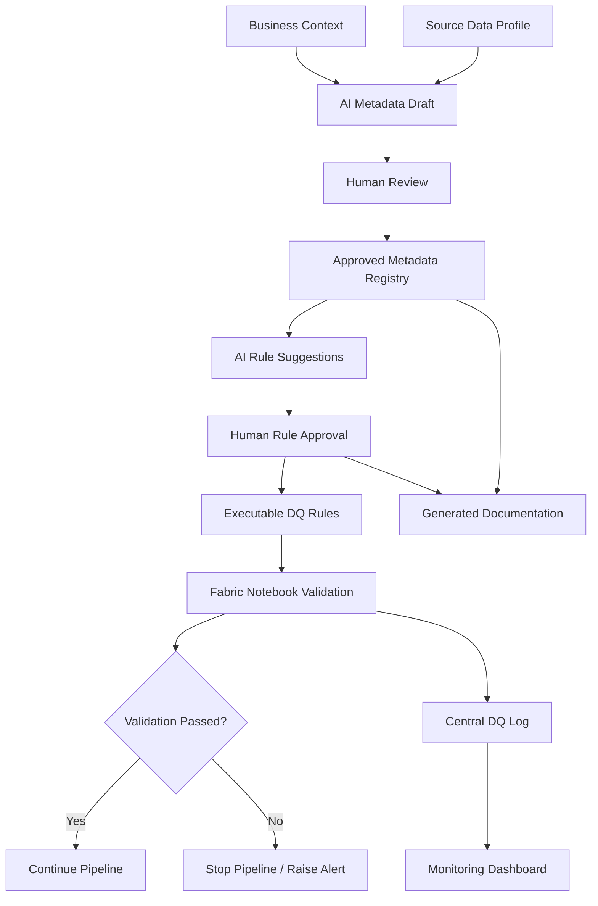

# AI-in-the-Loop Design Principles

This framework treats AI as a delivery co-pilot across the entire Microsoft Fabric lifecycle, not a bolt-on at the end of implementation.

## Core principles

1. **AI should assist across the full delivery lifecycle, not only at the end.**
   - AI can help convert requirements into first-pass metadata, checks, and documentation from day one.
2. **AI-generated metadata must be reviewed by humans.**
   - AI can draft quickly, but business and data owners must approve before runtime use.
3. **AI-generated DQ rules must be traceable to business intent.**
   - Every approved rule should link back to a plain-English business requirement.
4. **Approved rules should be stored as metadata/config.**
   - Rule definitions belong in registries and contracts, not hidden in ad-hoc notebook cells.
5. **Pipelines should enforce approved checks.**
   - Human-approved checks are applied consistently at ingestion and refresh time.
6. **Logs should make validation outcomes auditable.**
   - Rule outcomes, drift events, and pipeline decisions must be centrally logged.
7. **Documentation should be generated from the same metadata used by the pipeline.**
   - This keeps runbooks, test plans, and handover packs consistent with runtime logic.
8. **The framework should reduce handover friction for junior engineers and fresh graduates.**
   - Reusable templates and generated packs reduce reliance on tribal knowledge.

## Operating model

- **AI proposes** metadata, quality rules, and documentation drafts.
- **Humans approve** what is valid for business and operational use.
- **Pipelines enforce** the approved contracts and checks.
- **Documentation updates automatically** from the approved metadata and runtime logs.

