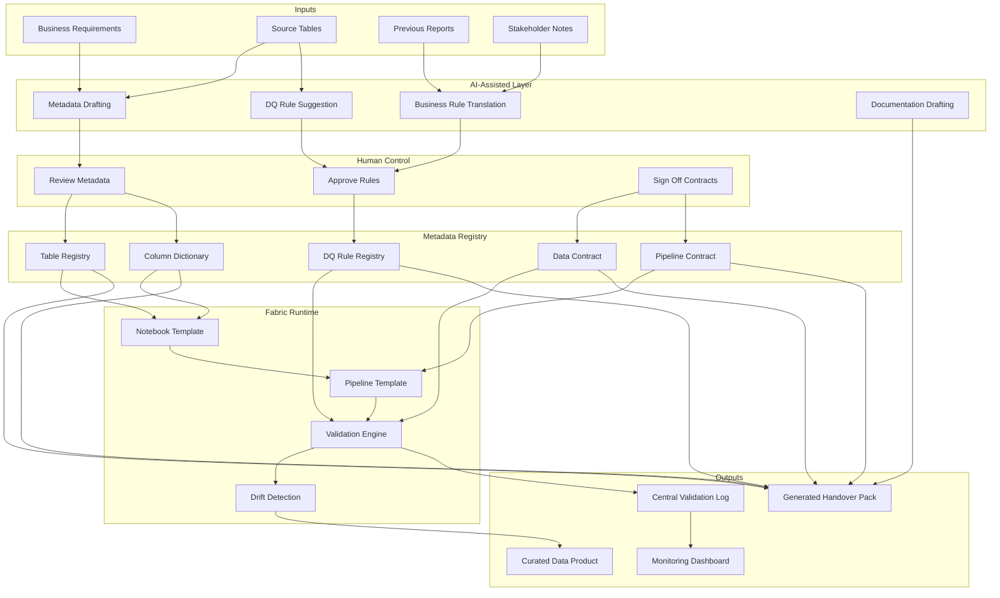

# Framework Architecture

This architecture describes a reusable delivery system for Microsoft Fabric projects, not only a set of coding snippets.

## High-level components

- **Metadata templates**
  - Table registry, column dictionary, DQ rule registry, and contracts.
- **AI-assisted metadata generation**
  - AI drafts metadata and rule ideas from requirements and source profiling.
- **Validation engine**
  - Executes approved quality and contract checks in notebook/pipeline runtime.
- **Drift detection**
  - Detects schema drift and data drift against expected baselines.
- **Governance labeling**
  - Applies and audits sensitivity or governance classifications.
- **Pipeline enforcement**
  - Pipelines enforce approved checks before publishing curated outputs.
- **Central validation log**
  - Stores pass/fail outcomes, thresholds, and alert context.
- **Documentation generation**
  - Produces handover packs and operational docs from metadata + logs.

