```mermaid
flowchart LR
    subgraph OUT["Outside Fabric"]
        O1["Business agreement"]
        O2["Approved usage, steward, definitions, caveats"]
        O3["Supporting files, mapping tables, reference data"]
        O4["Metadata collection and governance expectations"]
    end

    subgraph HUMAN["Inside Fabric: Human-guided"]
        H1["Notebook setup and runtime parameters"]
        H2["Source declaration"]
        H3["EDA and data nuance explanation"]
        H4["Transformation logic"]
        H5["DQ rule approval and exception review"]
        H6["Handover review"]
    end

    subgraph FRAMEWORK["Inside Fabric: Framework-run"]
        F1["Naming and runtime checks"]
        F2["Source profiling and metadata logging"]
        F3["Schema drift, data drift, incremental safety"]
        F4["DQ execution and contract validation"]
        F5["Technical columns and write pattern"]
        F6["Output profiling, lineage, run summary, metadata logs"]
    end

    OUT --> HUMAN
    HUMAN --> FRAMEWORK
    FRAMEWORK --> HUMAN
    HUMAN --> OUT

    AI["AI-assisted where useful:<br/>Copilot prompts or Fabric AI functions<br/>AI proposes, humans approve, framework records"]
    AI -.-> HUMAN
    AI -.-> FRAMEWORK
```

# Lifecycle Operating Model

This framework uses a three-lane model to separate preparation, human decisions, and framework automation.

## Three lanes
- **Outside Fabric:** business context and supporting context prepared before notebook runtime.
- **Inside Fabric: Human-guided:** practitioner-led setup, interpretation, transformation, approvals, and review.
- **Inside Fabric: Framework-run:** deterministic checks, contracts, metadata outputs, and handover artifacts.

AI is an assistance tag across selected steps; it is not a standalone accountable actor.

**Boundary:** AI proposes. Humans approve. The framework validates and records.

## End-to-end lifecycle

| Step | Stage | Lane |
|---:|---|---|
| 1 | Purpose, steward, usage, and caveats | Outside Fabric |
| 2 | Supporting data and metadata preparation | Outside Fabric |
| 3 | Dataset contract and runtime parameters | Inside Fabric: Human-guided |
| 4 | Source declaration | Inside Fabric: Human-guided |
| 5 | Source profiling | Inside Fabric: Framework-run |
| 6 | Schema drift, data drift, and incremental safety | Inside Fabric: Framework-run |
| 7 | EDA notes and data nuance explanation | Inside Fabric: Human-guided |
| 8 | Transformation logic | Inside Fabric: Human-guided |
| 9 | Technical columns and write pattern | Inside Fabric: Framework-run |
| 10 | Output profiling | Inside Fabric: Framework-run |
| 11 | DQ rules and runtime contract validation | Inside Fabric: Framework-run + Human-guided |
| 12 | Lineage and transformation summary | Inside Fabric: Framework-run + Human-guided |
| 13 | Run summary, AI context, and handover package | Inside Fabric: Framework-run + Human-guided |

## Lane responsibilities by phase

### Outside Fabric
- Confirm purpose, steward, approved usage, and caveats.
- Prepare supporting files, mapping tables, and reference data.
- Define governance expectations and metadata requirements.

### Inside Fabric: Human-guided
- Configure runtime parameters and contract intent.
- Declare sources and interpret source behavior.
- Author transformation logic and review exceptions.
- Approve DQ/contract outcomes and handover readiness.

### Inside Fabric: Framework-run
- Execute profiling, metadata logging, and safety gates.
- Enforce schema/data drift and incremental safety checks.
- Apply technical columns and standard write patterns.
- Execute DQ and contract checks.
- Generate lineage, run summary, and handover-ready outputs.

## Three-lane flow diagram

