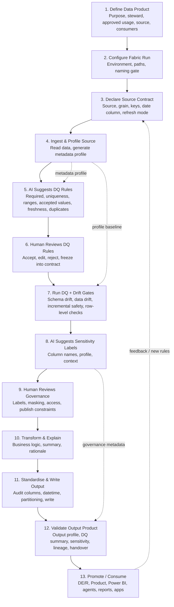

# Lifecycle Operating Model

This is the canonical MVP lifecycle for a **metadata-first, AI-in-the-loop Fabric data contract workflow**.

## Framework positioning
The framework is a reusable Fabric-first notebook workflow that turns raw/source data into documented, profiled, quality-checked, drift-aware, governed, AI-ready data products.

It is not a generic product lifecycle. It is a data contract lifecycle where metadata and profiles drive DQ, drift, governance, lineage, and promotion readiness.

## MVP lifecycle (canonical 13-step flow)

1. **Define Data Product**
   - Purpose
   - Steward
   - Approved usage
   - Source
   - Expected consumers

2. **Configure Fabric Run**
   - Environment
   - Source / Unified / Product path
   - Notebook naming gate

3. **Declare Source Contract**
   - Source table or file
   - Expected grain
   - Key columns
   - Date column
   - Refresh mode

4. **Ingest & Profile Source**
   - Read source data
   - Generate metadata profile
   - Store source profile

5. **AI Suggests DQ Rules**
   - Profile + metadata + business context produce suggested rules
   - Examples: required fields, uniqueness, valid ranges, accepted values, freshness, duplicate checks

6. **Human Reviews DQ Rules**
   - Accept / edit / reject rules
   - Freeze approved rules into the contract

7. **Run DQ + Drift Gates**
   - Schema drift
   - Data drift
   - Incremental safety
   - Row-level DQ checks
   - Pass / warn / fail behavior

8. **AI Suggests Sensitivity Labels**
   - Column names + profile + context suggest classification and governance notes

9. **Human Reviews Governance**
   - Confirm labels
   - Masking needs
   - Access rules
   - Publish constraints

10. **Transform & Explain**
   - Core business transformation
   - Transformation summary
   - Rationale logging

11. **Standardise & Write Output**
   - Audit columns
   - Datetime standardisation
   - Partitioning
   - Output write

12. **Validate Output Product**
   - Output profile
   - DQ result summary
   - Sensitivity summary
   - Lineage
   - Handover pack

13. **Promote / Consume**
   - Release to DE/R or Product layer
   - Power BI
   - Agents
   - Reports
   - Apps

## Mermaid flow

## AI-in-the-loop responsibilities
AI supports speed and consistency by drafting and explaining artefacts from metadata evidence.

- AI suggests DQ rules; humans approve contract rules.
- AI suggests sensitivity labels; humans approve governance.
- AI drafts transformation/lineage summaries; humans approve meaning and release decisions.

**Boundary:** AI proposes. Humans approve. The framework executes checks, records metadata, and produces reusable handover artefacts.
