# Lifecycle Operating Model

This framework uses three execution lanes so teams can separate business context preparation, human-guided notebook decisions, and framework automation.

## What the three lanes mean

- **Outside Fabric** covers business and governance context prepared before notebook execution.
- **Inside Fabric: Human-guided** covers setup, interpretation, and approvals performed by people in notebooks.
- **Inside Fabric: Framework-run** covers repeatable checks, validations, and metadata/logging behaviors implemented by the framework.

Business context still matters. Human review still matters. Framework automation still matters. AI is useful but not accountable.

## Outside Fabric

Outside Fabric work establishes the intent and constraints for the data product:

- purpose and steward ownership
- approved usage and caveats
- definitions and metric meaning
- supporting files, mapping tables, and reference data
- governance expectations and approval boundaries

## Inside Fabric: Human-guided

Human-guided work in Fabric notebooks includes:

- notebook setup and runtime parameters
- source declaration and expected grain
- EDA interpretation and data nuance explanation
- transformation logic decisions
- DQ rule approval and exception review
- handover review and acceptance decisions

## Inside Fabric: Framework-run

Framework-run work executes repeatable controls and outputs:

- profiling and metadata logging
- schema drift, data drift, and incremental safety checks
- DQ execution and runtime contract validation
- technical columns and standard write pattern
- output profiling, lineage capture, and run summary export
- metadata output artifacts for handover and monitoring

## AI assistance boundary

AI is a support mechanism, not an accountable actor.

Some human-guided and framework-run steps can be AI-assisted through Copilot or Fabric AI functions, but AI output must be reviewed before becoming part of the pipeline.

**AI proposes. Humans approve. The framework validates and records.**

## End-to-end lifecycle

| Step | Stage | Lane | Notes |
|---:|---|---|---|
| 1 | Purpose, steward, usage, and caveats | Outside Fabric | Business agreement and context before build |
| 2 | Supporting data and metadata preparation | Outside Fabric | Mapping files, reference data, manual metadata, governance expectations |
| 3 | Notebook setup and runtime parameters | Inside Fabric: Human-guided | Configure environment, source, target, flags |
| 4 | Source declaration | Inside Fabric: Human-guided | Declare source tables/files and expected grain |
| 5 | Source profiling and metadata logging | Inside Fabric: Framework-run | Framework profiles source and records metadata |
| 6 | Schema drift, data drift, and incremental safety | Inside Fabric: Framework-run | Framework blocks unsafe changes where configured |
| 7 | EDA notes and data nuance explanation | Inside Fabric: Human-guided | Human interprets profile, captures caveats; may use AI assistance |
| 8 | Transformation logic | Inside Fabric: Human-guided | Dataset-specific transformation logic |
| 9 | Technical columns and write pattern | Inside Fabric: Framework-run | Add audit fields, hashes, timestamps, standard write behavior |
| 10 | Output profiling | Inside Fabric: Framework-run | Framework profiles output and records metadata |
| 11 | DQ rules and runtime contract validation | Inside Fabric: Framework-run + Human-guided | Framework executes; human approves rules and reviews exceptions |
| 12 | Lineage and transformation summary | Inside Fabric: Framework-run + Human-guided | Framework records lineage; AI may draft summaries; human reviews |
| 13 | Run summary, AI context, and handover package | Inside Fabric: Framework-run + Human-guided | Framework exports; human accepts handover |

## Handoff points

- **Outside Fabric → Human-guided**: approved context and supporting artifacts are ready for notebook execution.
- **Human-guided → Framework-run**: parameters, source declarations, and transformation intent are ready for automated execution.
- **Framework-run → Human-guided**: checks, contracts, and summaries are reviewed before acceptance.
- **Human-guided → Outside Fabric**: handover package returns to business/governance stakeholders for operational use.

## Mermaid diagram

```mermaid
flowchart LR
    subgraph OUT["Outside Fabric"]
        O1["Business agreement"]
        O2["Approved usage, steward, definitions, caveats"]
        O3["Supporting files, mapping tables, reference data"]
        O4["Metadata collection and governance expectations"]
    end

    subgraph HUMAN["Inside Fabric: Human-guided"]
        H1["Notebook setup and runtime parameters"]
        H2["Source declaration"]
        H3["EDA and data nuance explanation"]
        H4["Transformation logic"]
        H5["DQ rule approval and exception review"]
        H6["Handover review"]
    end

    subgraph FRAMEWORK["Inside Fabric: Framework-run"]
        F1["Naming and runtime checks"]
        F2["Source profiling and metadata logging"]
        F3["Schema drift, data drift, incremental safety"]
        F4["DQ execution and contract validation"]
        F5["Technical columns and write pattern"]
        F6["Output profiling, lineage, run summary, metadata logs"]
    end

    OUT --> HUMAN
    HUMAN --> FRAMEWORK
    FRAMEWORK --> HUMAN
    HUMAN --> OUT

    AI["AI-assisted where useful:<br/>Copilot prompts or Fabric AI functions<br/>AI proposes, humans approve, framework records"]
    AI -.-> HUMAN
    AI -.-> FRAMEWORK
```

