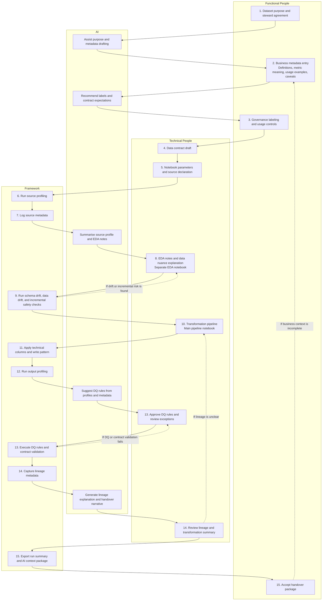

# Lifecycle Operating Model

This framework is an operating model and reusable notebook framework for building governed, quality-checked, handover-ready data products in Microsoft Fabric.

## Four actors

### Functional People
Business owners, data stewards, process owners, domain SMEs, and report consumers.
They own business meaning, usage, definitions, caveats, governance approval, and handover acceptance.

### Technical People
Data analysts, data scientists, data engineers, and Fabric developers.
They own source declaration, profiling interpretation, EDA, transformation logic, data contracts, DQ rules, and exception review.

### AI
Copilot / Fabric AI / ChatGPT-style assistant.
AI drafts, summarizes, recommends, explains, and generates candidate rules, labels, lineage, and handover context.
AI does not approve, govern, or sign off production readiness.

### Framework
Reusable notebooks, utilities, metadata tables, gates, and templates.
The framework runs profiling, logs metadata, executes drift checks, applies write patterns, validates contracts, executes DQ rules, and exports handover context.

Functional people define meaning. Technical people turn meaning into data products. AI accelerates documentation and reasoning. The framework makes the process repeatable, validated, and handover-ready.

## 15-step lifecycle

| Step | Stage | Primary actor | Where it happens |
|---:|---|---|---|
| 1 | Dataset purpose and steward agreement | Functional People | Governance doc / metadata table |
| 2 | Business metadata entry | Functional People | Metadata table / form |
| 3 | Governance labeling and usage controls | Functional People | Governance doc / metadata table |
| 4 | Data contract draft | Technical People | Contract file / notebook |
| 5 | Notebook parameters and source declaration | Technical People | Main pipeline notebook |
| 6 | Source profiling | Framework | Profiling notebook / utility |
| 7 | Source metadata logging | Framework | Metadata table |
| 8 | EDA notes and data nuance explanation | Technical People | Separate EDA notebook |
| 9 | Schema drift, data drift, and incremental safety checks | Framework | Checks notebook / reusable gate |
| 10 | Transformation pipeline | Technical People | Main pipeline notebook |
| 11 | Technical columns and write pattern | Framework | Main pipeline notebook |
| 12 | Output profiling | Framework | Profiling utility / metadata table |
| 13 | DQ rules and contract validation | Technical People + Framework | Checks notebook / pipeline gate |
| 14 | Lineage and transformation summary | Framework + AI + Technical People | Handover notebook |
| 15 | Handover package and AI context export | Framework + AI, accepted by Functional People | Handover notebook |

## Lifecycle flow

## Where work happens

- **Governance doc / metadata table** for purpose, steward, business metadata, labels, and business signoff.
- **Profiling notebook** for source profiling and source metadata logging.
- **Separate EDA notebook** for analyst interpretation, caveats, and assumptions.
- **Main pipeline notebook** for parameter setup, source declaration, transformation logic, technical columns, and write pattern.
- **Checks notebook / reusable gates** for drift checks, incremental safety, DQ rules, and contract validation.
- **Handover notebook** for lineage summary, run summary, AI context export, and final handover package.
