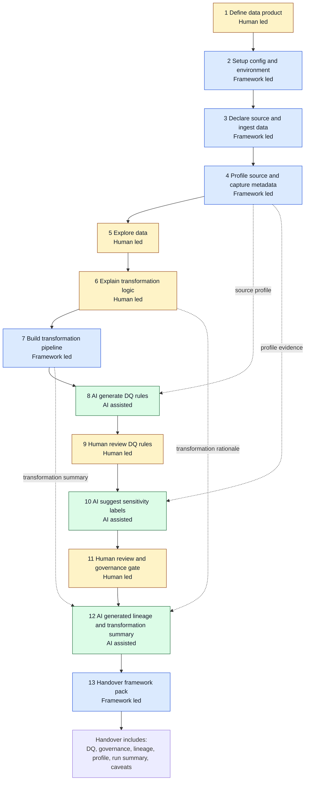

# Lifecycle Operating Model

Canonical order for the MVP workflow in this metadata-first, AI-in-the-loop, Fabric-first framework.

AI proposes. Humans approve. The framework validates, logs, and produces handover artifacts.
