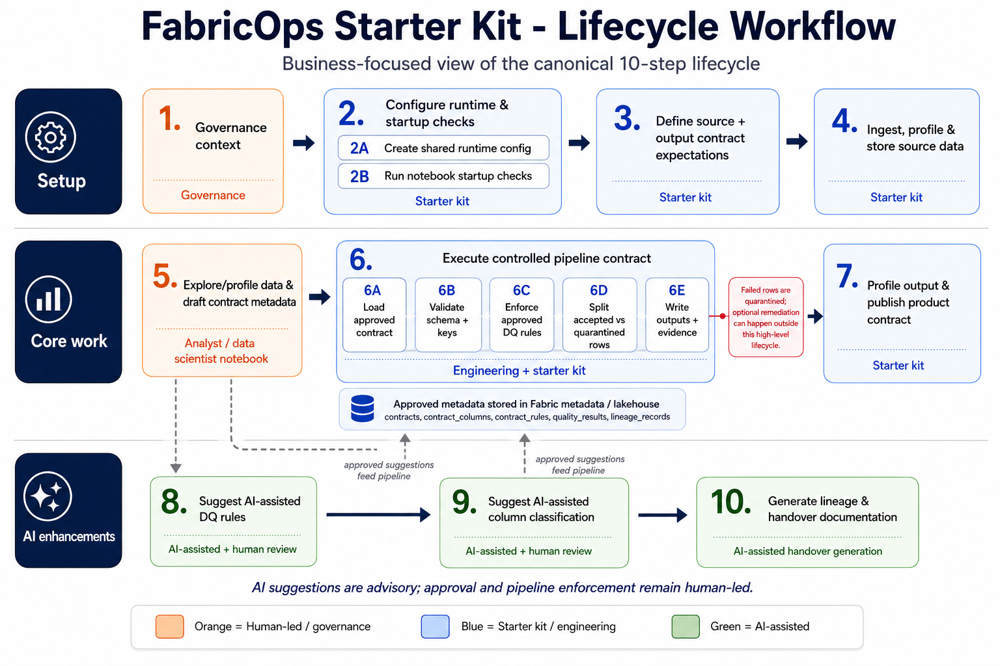

# Lifecycle Operating Model

FabricOps Starter Kit uses a governance-centered, role-based operating model where approved metadata is enforced through pipeline contracts and assembled into handover outputs.

## 1. Governance steward

Governance stewards define the data sharing agreement and approved usage once, including business context, classification, and sensitivity/PII handling.

AI role: AI suggests governance metadata candidates, and a human governance steward approves controls.

## 2. Analyst / data scientist

Analysts and data scientists profile source data, validate business meaning, and review DQ rule candidates.

AI role: AI applies/suggests candidate rules, and humans validate rule validity.

## 3. Data engineer

Data engineers build and run pipeline contracts that:

- load approved metadata
- move source to target
- enforce approved DQ rules
- quarantine failures
- write runtime evidence

## 4. Handover / data contract

Handover is generated from approved metadata, lineage, quality results, and execution evidence.

AI role: AI generates handover from approved metadata-backed records; no human is needed for generation.

## 5. Metadata / contract store (source of truth)

The metadata-backed contract store is the operational source of truth:

- `contracts`
- `contract_columns`
- `contract_rules`
- `quality_results`
- `lineage_records`

## 6. Core operational loop: Step 5 → Step 2

Pipeline evidence from engineering feeds back into governance metadata.

This Step 5 → Step 2 loop is the governance-engineering loop that continuously improves future agreements and enforcement quality.

## AI touchpoints

- Step 2 (analyst/data scientist): AI suggests; human approves.
- Step 4 (data engineer enforcement context): AI applies/suggests rule candidates; human validates rule validity before approval.
- Step 6 (handover): AI generates from approved metadata and evidence, with no human needed for generation.

## Related documentation

- [Governance Operating Model](governance-operating-model.md)
- [Notebook Structure](notebook-structure.md)
- [Metadata and Data Contract Assembly](metadata-and-contracts.md)
- [Data Quality Rules System](data-quality-rules-system.md)
