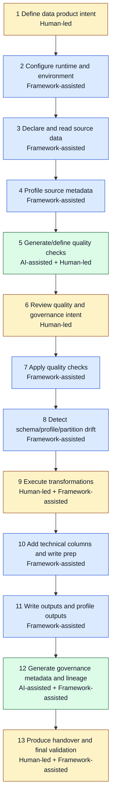

# Lifecycle Operating Model

This page defines the single end-to-end workflow for FabricOps Starter Kit.

## Operating roles

- **Human-led steps** define intent, approve business thresholds, and make release decisions.
- **Framework-assisted deterministic checks** execute reusable validation, profiling, drift, and metadata routines.
- **AI-assisted steps** propose rule candidates, summaries, and classifications that humans review.

## 13-step end-to-end workflow

## Practical use

Use [Quick Start](quick-start.md) to execute the workflow and [Reference](reference/index.md) to locate callable functions by step.
