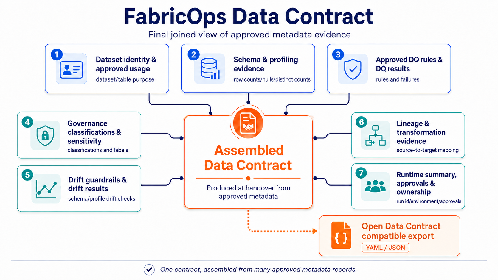

# Metadata and Contracts

FabricOps treats a data contract as an assembled operating agreement, not a single file or a single software module.

In practice, the contract is built from:

- `00_env_config` runtime configuration
- agreement and approved usage
- `02_ex` exploration notebook outputs
- `03_pc` pipeline contract notebook logic
- FabricOps callable functions used by the notebooks

*In FabricOps, the data contract is assembled from configuration, approved usage, profiling, transformation logic, quality rules, and runtime evidence. It is reviewed by humans and enforced by the pipeline notebook.*

## How to use this section

- **Contract model** explains the ODCS-aligned model and why FabricOps is table-first in runtime operations.
- **Metadata tables** lists what metadata is stored for contract enforcement and audit evidence.
- **Notebook responsibilities** clarifies what `02_ex` and `03_pc` each contribute to contract assembly.

## Contract assembly at a glance

| Input to the contract | Role in FabricOps |
| --- | --- |
| `00_env_config` | Provides runtime configuration and environment assumptions. |
| Agreement and approved usage | Defines what usage is approved and what boundaries apply. |
| `02_ex` notebook | Profiles data and drafts candidate schema, quality, and sensitivity expectations. |
| `03_pc` notebook | Enforces approved expectations and writes execution evidence. |
| FabricOps callable functions | Provide reusable logic for profiling, quality, metadata persistence, and summaries. |

For implementation detail, continue to the child pages in this section.
