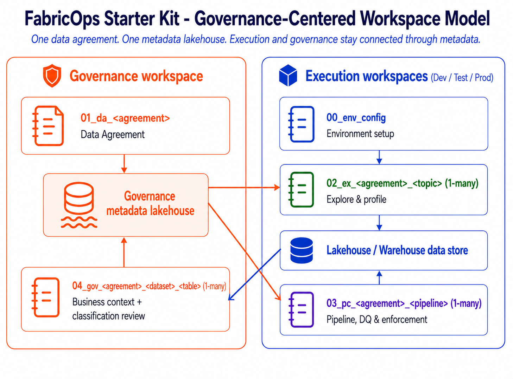

# Notebook Structure

Notebook Structure is the canonical guide for notebook ownership, governance responsibilities, and execution behavior in FabricOps Starter Kit.



## Workspace layout

`01_data_sharing_agreement_<agreement>` is the governance-owned control-plane notebook and is defined once as the agreement source of truth.

Each execution environment (Sandbox, Dev/Test, Prod) reuses approved agreement metadata.

```text
Governance Workspace
└── 01_data_sharing_agreement_<agreement>

Environment Workspace (Sandbox / Dev-Test / Prod)
├── 00_env_config
├── 02_ex_<agreement>_<topic>      (1-many)
├── 03_pc_<agreement>_<pipeline>   (1-many)
└── Local metadata/evidence lakehouse
```

## Notebook roles and responsibilities

| Notebook | Primary ownership | Scope | What belongs here |
|---|---|---|---|
| `00_env_config` | Platform / engineering | Environment runtime configuration | Shared environment config, paths, runtime settings, startup checks, and reusable config objects. |
| `01_data_sharing_agreement_<agreement>` | Governance steward / data owner | Cross-environment governance control plane | Agreement context, approved usage, business context, ownership, permissions, restrictions, classification, sensitivity/PII posture, and approved DQ metadata. |
| `02_ex_<agreement>_<topic>` | Analyst / data scientist | Exploration and proposal | Profiling, discovery, exploratory transforms, AI-assisted DQ suggestions, AI-assisted classification suggestions, and metadata evidence that informs governance updates. |
| `03_pc_<agreement>_<pipeline>` | Data engineer | Pipeline contract enforcement | Run-all-safe and schedulable execution that loads approved metadata/rules/classifications, performs deterministic transforms, writes outputs, and records runtime evidence. |

## Governance flow across notebooks

- Governance is defined once in `01_data_sharing_agreement_<agreement>`.
- Sandbox, Dev/Test, and Prod notebooks reuse approved governance metadata.
- `02_ex` notebooks propose metadata evidence updates based on profiling and AI-assisted evidence; they do not define agreements.
- `03_pc` notebooks load approved agreement metadata and enforce it during execution; they do not define agreements.
- Pipeline execution writes operational evidence for quality, lineage, and controls.
- That evidence can feed back into governance metadata updates.
- Core operational loop: `03_pc` evidence → `01_data_sharing_agreement` governance update.

## AI boundary and human approval

- **Governance**: AI suggests classification, sensitivity, and PII candidates; humans approve governance controls.
- **Data quality**: AI applies or suggests candidate rules; humans validate rule validity before enforcement.
- **Handover**: AI can generate summaries from approved metadata and runtime evidence.
- **Control authority**: AI does not approve governance controls.

## Notebook details

- [`00_env_config`](notebook-structure/00-env-config.md)
- [`01_data_sharing_agreement_<agreement>`](notebook-structure/01-data-sharing-agreement.md)
- [`02_ex_<agreement>_<topic>`](notebook-structure/02-exploration.md)
- [`03_pc_<agreement>_<pipeline>`](notebook-structure/03-pipeline-contract.md)

## Related pages

- [Lifecycle Operating Model](lifecycle-operating-model.md)
- [Metadata and Data Contract Assembly](metadata-and-contracts.md)
- [Data Quality Rules System](data-quality-rules-system.md)

- 02_ex and 03_pc notebooks select an existing agreement_id from METADATA_DATA_AGREEMENT and self-register to METADATA_NOTEBOOK_REGISTRY.

- Agreement metadata selection in `02_ex` and `03_pc` uses agreement-selection helpers from `data_agreement.py`, while `metadata.py` persists metadata evidence and notebook traceability; governance approvals remain in `data_governance.py` and `01_data_sharing_agreement_<agreement>`.
