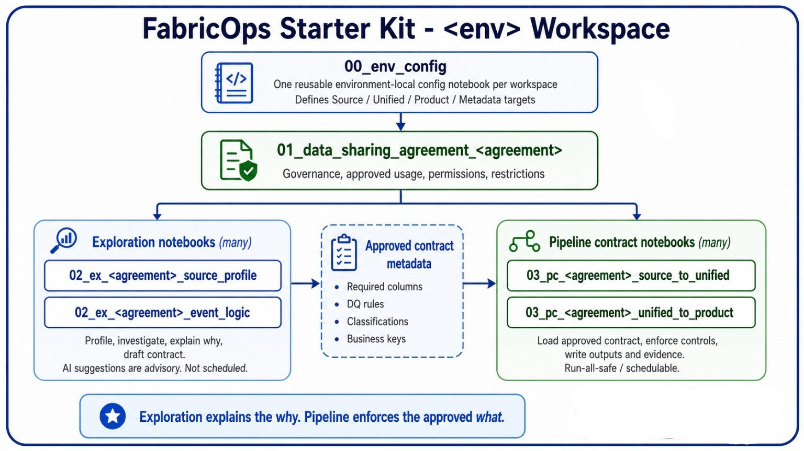

# Notebook Structure

This page defines the governance-centered workspace model for FabricOps Starter Kit.



## Governance-centered workspace layout

`01_data_sharing_agreement_<agreement>` belongs logically to the governance workspace and governance metadata lakehouse, where agreement-level controls are defined once.

Each execution environment (Sandbox, Dev/Test, Prod) reuses that agreement context and approved metadata.

```text
Governance Workspace
└── 01_data_sharing_agreement_<agreement>

Environment Workspace (Sandbox / Dev-Test / Prod)
├── 00_env_config
├── 02_ex_<agreement>_<topic>      (1-many)
├── 03_pc_<agreement>_<pipeline>   (1-many)
└── Local metadata/evidence lakehouse
```

## Notebook naming, ownership, and scope

| Notebook | Primary ownership | Scope | What belongs here |
|---|---|---|---|
| `00_env_config` | Platform / engineering | Environment runtime config | Shared environment settings, startup checks, paths, and runtime configuration. |
| `01_data_sharing_agreement_<agreement>` | Governance steward / data owner | Cross-environment governance control plane | Agreement definition, approved usage, business context, ownership, restrictions, classification, sensitivity/PII policy, and approved governance metadata. |
| `02_ex_<agreement>_<topic>` | Analyst / data scientist | Environment exploration and proposal | Source profiling, interpretation, and proposals to update governance/DQ metadata. |
| `03_pc_<agreement>_<pipeline>` | Data engineer | Environment pipeline enforcement | Deterministic pipeline contracts that load approved metadata, enforce controls, quarantine failures, and write execution evidence. |

## Operating behavior

- Every notebook keeps the data agreement context in view.
- Exploration notebooks propose updates; they do not become source of truth by themselves.
- Pipeline contract notebooks load approved metadata and enforce it deterministically.
- Agreement definition is not cloned per environment; it is defined once and reused.

## Notebook details

- [`00_env_config`](notebook-structure/00-env-config.md)
- [`02_ex_<agreement>_<topic>`](notebook-structure/02-exploration.md)
- [`03_pc_<agreement>_<pipeline>`](notebook-structure/03-pipeline-contract.md)

## Related pages

- [Governance Operating Model](governance-operating-model.md)
- [Lifecycle Operating Model](lifecycle-operating-model.md)
- [Metadata and Data Contract Assembly](metadata-and-contracts.md)
- [Data Quality Rules System](data-quality-rules-system.md)
