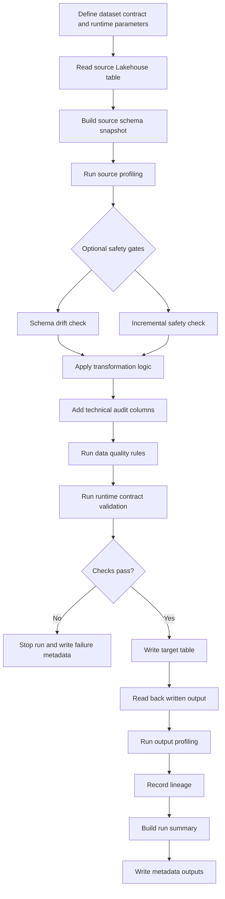

# Quick Start

## Public-safe reminder
Do not commit real organisational data, secrets, tenant details, internal table names, workspace names, screenshots, or production metadata.

## What you can test today
The current MVP is a **single Fabric notebook flow** that turns one source Lakehouse table into one target table with repeatable checks and metadata.

Today you can test:
- contract + runtime parameter loading
- source read, schema snapshot, and source profiling
- optional schema drift and incremental safety checks
- transformation logic plus technical audit columns
- data quality and runtime contract validation
- conditional target write (write only when gates pass)
- output profiling, lineage, run summary, and metadata outputs

This gives you a practical end-to-end pattern for governed, repeatable Fabric data products without rebuilding notebook scaffolding for each dataset.

## Current MVP workflow



## Recommended first Fabric smoke test
1. Create a small synthetic source table in a Fabric Lakehouse (for example 20–100 rows).
2. Copy `templates/notebooks/fabric_data_product_mvp.py` into a Fabric notebook.
3. Set runtime config to your test dataset, source table, and target table.
4. Run with `PROFILE_ONLY = True` to verify source read, schema snapshot, and profiling metadata.
5. Run with `DRY_RUN = True` to execute transformation, technical columns, DQ, contract validation, lineage, and run summary **without** final target write.
6. Run with `PROFILE_ONLY = False` and `DRY_RUN = False` to perform the actual target write after checks pass.
7. Confirm target data and metadata outputs were created for each stage.

## Execution stages
- **Stage 1: `PROFILE_ONLY = True`**  
  Focus on source read, schema/profile capture, and metadata shape.
- **Stage 2: `DRY_RUN = True`**  
  Run the full logic and gates without publishing target data.
- **Stage 3: actual target write** (`PROFILE_ONLY = False`, `DRY_RUN = False`)  
  Publish target table only when quality and contract checks pass.

## Expected outputs
From the current MVP notebook template, expect metadata outputs such as:
- run metadata (run id, dataset, notebook/runtime context, status)
- source schema snapshot and source profile summary
- optional drift/incremental safety check results
- data quality results and runtime contract validation results
- lineage records (source-to-target mapping)
- run summary record
- output profile summary after write

## Useful code snippets

### Contract validation
```python
from fabric_data_product_framework.config import load_and_validate_dataset_contract

contract, errors = load_and_validate_dataset_contract(
    "examples/configs/sample_dataset_contract.yaml"
)
```

### Runtime context helper
```python
from fabric_data_product_framework.runtime import assert_notebook_name_valid, build_runtime_context

ctx = build_runtime_context(
    dataset_name="synthetic_orders",
    environment="dev",
    source_table="source.synthetic_orders",
    target_table="product.synthetic_orders",
    notebook_name="source_to_product_synthetic_orders",
)

assert_notebook_name_valid(
    ctx["notebook_name"],
    allowed_prefixes=["source_to_product_", "bronze_to_silver_", "silver_to_gold_"],
)
```

### Data quality gate
```python
from fabric_data_product_framework.quality import assert_quality_gate, run_quality_rules

quality_result = run_quality_rules(
    df_output,
    contract.get("quality_rules", []),
    dataset_name=ctx["dataset_name"],
    table_name=ctx["target_table"],
    engine="spark",
)

assert_quality_gate(quality_result)
```

## Execution engines
The framework exposes engine-aware dataframe APIs with `engine="auto" | "pandas" | "spark"`.

- **pandas**: local and synthetic workloads
- **spark**: Fabric/lakehouse-scale workloads
- **auto**: runtime engine detection

See [engine model](engine-model.md) for full behavior details.

## Current limitations
- Governance labeling checks are not fully implemented end-to-end yet.
- AI context export is not fully implemented end-to-end yet.
- Treat additional governance automation as planned work, not current guaranteed behavior.
