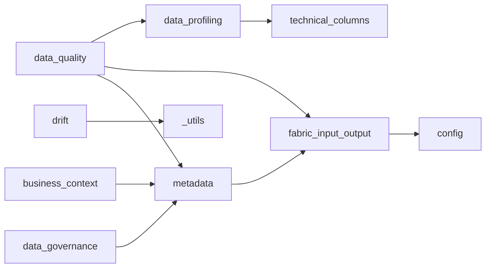

# Callable Map

This page is generated from FabricOps source code using static AST parsing. It shows module dependencies, public callables, internal helpers, and cross-module calls.

## 1. Module dependency graph

## 2. Public callables by module

| Module | Public callable | Referenced by |
|---|---|---|
| `business_context` | `draft_business_context` | — |
| `business_context` | `extract_column_business_context_suggestions` | — |
| `business_context` | `get_reviewed_business_context_rows` | — |
| `business_context` | `prepare_business_context_profile_input` | — |
| `business_context` | `review_business_context` | — |
| `business_context` | `write_business_context` | — |
| `config` | `load_config` | `fabricops_kit.config._bootstrap_fabric_env`, `fabricops_kit.config.setup_notebook`, `fabricops_kit.fabric_input_output.load_config` |
| `config` | `setup_notebook` | — |
| `data_agreement` | `get_selected_agreement` | — |
| `data_agreement` | `load_agreements` | — |
| `data_agreement` | `select_agreement` | — |
| `data_governance` | `draft_governance` | — |
| `data_governance` | `extract_governance_suggestions` | — |
| `data_governance` | `load_governance` | — |
| `data_governance` | `prepare_governance_input` | — |
| `data_governance` | `review_governance` | — |
| `data_governance` | `write_governance` | — |
| `data_lineage` | `build_lineage_handover_markdown` | — |
| `data_lineage` | `build_lineage_records` | — |
| `data_profiling` | `profile_dataframe` | `fabricops_kit.data_quality.__prepare_dq_profile_input_rows` |
| `data_quality` | `assert_dq_passed` | — |
| `data_quality` | `draft_dq_rules` | — |
| `data_quality` | `enforce_dq` | — |
| `data_quality` | `get_dq_review_results` | — |
| `data_quality` | `load_dq_rules` | — |
| `data_quality` | `review_dq_rule_deactivations` | — |
| `data_quality` | `review_dq_rules` | `fabricops_kit.data_quality.run_dq_rule_review_widget` |
| `data_quality` | `validate_dq_rules` | `fabricops_kit.data_quality._run_dq_rules`, `fabricops_kit.data_quality._split_dq_rows`, `fabricops_kit.data_quality.enforce_dq`, `fabricops_kit.data_quality.write_dq_rules` |
| `data_quality` | `write_dq_rules` | — |
| `drift` | `check_partition_drift` | — |
| `drift` | `check_profile_drift` | — |
| `drift` | `check_schema_drift` | — |
| `drift` | `summarize_drift_results` | — |
| `fabric_input_output` | `FabricStore` | — |
| `fabric_input_output` | `read_lakehouse_csv` | — |
| `fabric_input_output` | `read_lakehouse_excel` | — |
| `fabric_input_output` | `read_lakehouse_parquet` | — |
| `fabric_input_output` | `read_lakehouse_table` | — |
| `fabric_input_output` | `read_warehouse_table` | — |
| `fabric_input_output` | `write_lakehouse_table` | `fabricops_kit.data_quality.write_dq_rules`, `fabricops_kit.fabric_input_output.seed_minimal_sample_source_table`, `fabricops_kit.metadata.write_metadata_rows` |
| `fabric_input_output` | `write_warehouse_table` | — |
| `handover` | `build_handover` | — |
| `handover` | `render_handover_markdown` | `fabricops_kit.handover.build_handover_record` |
| `metadata` | `load_notebook_registry` | — |
| `metadata` | `register_current_notebook` | — |
| `technical_columns` | `standardize_columns` | — |

## 3. Internal helper index

| Module | Internal helper | Called by public callables |
|---|---|---|
| `_utils` | `_to_jsonable` | — |
| `business_context` | `_extract_column_business_context_suggestions` | `fabricops_kit.business_context.extract_column_business_context_suggestions` |
| `business_context` | `_parse_ai_dict_response` | — |
| `business_context` | `_prepare_business_context_profile_input` | `fabricops_kit.business_context.prepare_business_context_profile_input` |
| `business_context` | `_require_ipywidgets` | `fabricops_kit.business_context.review_business_context` |
| `config` | `_bootstrap_fabric_env` | — |
| `config` | `_check_fabric_ai_functions_available` | — |
| `config` | `_check_spark_session` | — |
| `config` | `_configure_fabric_ai_functions` | — |
| `config` | `_default_schema_text` | — |
| `config` | `_format_error_path` | — |
| `config` | `_get_fabric_runtime_metadata` | — |
| `config` | `_get_store` | `fabricops_kit.config.setup_notebook`, `fabricops_kit.fabric_input_output.read_lakehouse_csv`, `fabricops_kit.fabric_input_output.read_lakehouse_excel`, `fabricops_kit.fabric_input_output.read_lakehouse_parquet`, `fabricops_kit.fabric_input_output.read_lakehouse_table`, `fabricops_kit.fabric_input_output.read_warehouse_table`, `fabricops_kit.fabric_input_output.write_lakehouse_table`, `fabricops_kit.fabric_input_output.write_warehouse_table` |
| `config` | `_load_schema` | — |
| `config` | `_normalize_name` | — |
| `config` | `_run_config_smoke_tests` | `fabricops_kit.config.setup_notebook` |
| `config` | `_validate_framework_config` | `fabricops_kit.config.load_config` |
| `config` | `_validate_notebook_name` | — |
| `data_agreement` | `_agreement_option_label` | `fabricops_kit.data_agreement.select_agreement` |
| `data_agreement` | `_coerce_row_dicts` | `fabricops_kit.data_agreement.load_agreements`, `fabricops_kit.data_agreement.select_agreement` |
| `data_agreement` | `_latest_distinct_agreements` | `fabricops_kit.data_agreement.load_agreements` |
| `data_governance` | `_approved_widget_rows` | `fabricops_kit.data_governance.write_governance` |
| `data_governance` | `_build_governance_context` | — |
| `data_governance` | `_coerce_row_dicts` | `fabricops_kit.data_governance.load_governance` |
| `data_governance` | `_extract_pii_suggestions` | `fabricops_kit.data_governance.extract_governance_suggestions` |
| `data_governance` | `_prepare_governance_input` | `fabricops_kit.data_governance.prepare_governance_input` |
| `data_governance` | `_undo_last_action` | `fabricops_kit.data_governance.review_governance` |
| `data_lineage` | `_build_lineage_record_from_steps` | — |
| `data_lineage` | `_build_lineage_records` | — |
| `data_lineage` | `_call_name` | — |
| `data_lineage` | `_enrich_lineage_steps_with_ai` | — |
| `data_lineage` | `_fallback_copilot_lineage_prompt` | — |
| `data_lineage` | `_flatten_chain` | — |
| `data_lineage` | `_literal` | — |
| `data_lineage` | `_name` | — |
| `data_lineage` | `_resolve_write_target` | — |
| `data_lineage` | `_scan_notebook_cells` | — |
| `data_lineage` | `_scan_notebook_lineage` | — |
| `data_lineage` | `_step` | — |
| `data_lineage` | `_validate_lineage_steps` | — |
| `data_profiling` | `_get_profiled_columns` | `fabricops_kit.data_profiling.profile_dataframe` |
| `data_profiling` | `_is_min_max_supported_type` | `fabricops_kit.data_profiling.profile_dataframe` |
| `data_quality` | `__parse_dq_rules_dict_from_text` | — |
| `data_quality` | `__prepare_dq_profile_input_rows` | `fabricops_kit.data_quality.draft_dq_rules` |
| `data_quality` | `_approved_dq_rules_from_review_rows` | — |
| `data_quality` | `_attach_rule_metadata_keys` | `fabricops_kit.data_quality.get_dq_review_results` |
| `data_quality` | `_build_dq_rule_deactivation_metadata_df` | — |
| `data_quality` | `_build_dq_rule_deactivations` | — |
| `data_quality` | `_build_dq_rule_history` | `fabricops_kit.data_quality.write_dq_rules` |
| `data_quality` | `_build_dq_rules_metadata_df` | — |
| `data_quality` | `_extract_candidate_rules_from_responses` | — |
| `data_quality` | `_extract_dq_rules` | `fabricops_kit.data_quality.draft_dq_rules` |
| `data_quality` | `_latest_dq_rule_versions` | — |
| `data_quality` | `_load_active_dq_rule_metadata` | — |
| `data_quality` | `_load_active_dq_rules` | `fabricops_kit.data_quality.enforce_dq`, `fabricops_kit.data_quality.load_dq_rules` |
| `data_quality` | `_prepare_dq_profile_input_rows` | — |
| `data_quality` | `_profile_for_dq` | — |
| `data_quality` | `_require_ipywidgets` | `fabricops_kit.data_quality.review_dq_rule_deactivations`, `fabricops_kit.data_quality.review_dq_rules` |
| `data_quality` | `_run_dq_rules` | `fabricops_kit.data_quality.enforce_dq` |
| `data_quality` | `_split_dq_rows` | `fabricops_kit.data_quality.enforce_dq` |
| `data_quality` | `_suggest_dq_rules` | `fabricops_kit.data_quality.draft_dq_rules` |
| `data_quality` | `_suggest_dq_rules_with_fabric_ai` | — |
| `drift` | `_build_pandas_partition_snapshot` | — |
| `drift` | `_build_pandas_schema_snapshot` | — |
| `drift` | `_build_partition_hash` | — |
| `drift` | `_build_spark_partition_snapshot` | — |
| `drift` | `_build_spark_schema_snapshot` | — |
| `drift` | `_column_hash` | — |
| `drift` | `_hash` | — |
| `drift` | `_is_closed_partition` | — |
| `drift` | `_is_missing_table_error` | — |
| `drift` | `_json_dumps` | — |
| `drift` | `_resolve_change_behavior` | — |
| `drift` | `_safe_spark_collect` | — |
| `drift` | `_utc_now_iso` | — |
| `drift` | `_write_metadata_rows` | — |
| `fabric_input_output` | `_convert_single_parquet_ns_to_us` | `fabricops_kit.fabric_input_output.read_lakehouse_parquet` |
| `fabric_input_output` | `_get_fabric_runtime_context` | — |
| `fabric_input_output` | `_get_spark` | `fabricops_kit.fabric_input_output.read_lakehouse_csv`, `fabricops_kit.fabric_input_output.read_lakehouse_excel`, `fabricops_kit.fabric_input_output.read_lakehouse_parquet`, `fabricops_kit.fabric_input_output.read_lakehouse_table`, `fabricops_kit.fabric_input_output.read_warehouse_table` |
| `handover` | `_status_of` | `fabricops_kit.handover.render_handover_markdown` |
| `metadata` | `_context_get` | `fabricops_kit.metadata.register_current_notebook` |
| `metadata` | `_extract_columns_from_profile` | — |
| `metadata` | `_key_part` | — |
| `metadata` | `_now_utc_iso` | `fabricops_kit.data_governance.review_governance` |
| `metadata` | `_resolve_action_by` | — |
| `metadata` | `_runtime_context` | `fabricops_kit.metadata.register_current_notebook` |
| `metadata` | `_safe_str` | `fabricops_kit.metadata.register_current_notebook` |
| `metadata` | `_sha256_key` | — |
| `technical_columns` | `__add_audit_columns` | — |
| `technical_columns` | `__add_datetime_features` | — |
| `technical_columns` | `__add_hash_columns` | — |
| `technical_columns` | `_assert_columns_exist` | — |
| `technical_columns` | `_bucket_values_pandas` | — |
| `technical_columns` | `_default_technical_columns` | — |
| `technical_columns` | `_get_fabric_runtime_context` | — |
| `technical_columns` | `_hash_row` | — |
| `technical_columns` | `_non_technical_columns` | — |
| `technical_columns` | `_safe_string` | — |

## 4. Cross-module FabricOps calls

| Caller | Callee | Callee kind |
|---|---|---|
| `fabricops_kit.business_context.review_business_context` | `fabricops_kit.metadata.build_metadata_column_key` | `internal_callable` |
| `fabricops_kit.business_context.review_business_context` | `fabricops_kit.metadata.build_metadata_table_key` | `internal_callable` |
| `fabricops_kit.business_context.write_business_context` | `fabricops_kit.metadata.write_column_business_context` | `internal_callable` |
| `fabricops_kit.data_governance._approved_widget_rows` | `fabricops_kit.metadata._resolve_action_by` | `internal_helper` |
| `fabricops_kit.data_governance.review_governance` | `fabricops_kit.metadata._now_utc_iso` | `internal_helper` |
| `fabricops_kit.data_governance.review_governance` | `fabricops_kit.metadata.build_metadata_column_key` | `internal_callable` |
| `fabricops_kit.data_governance.review_governance` | `fabricops_kit.metadata.build_metadata_table_key` | `internal_callable` |
| `fabricops_kit.data_profiling._get_profiled_columns` | `fabricops_kit.technical_columns._default_technical_columns` | `internal_helper` |
| `fabricops_kit.data_quality.__prepare_dq_profile_input_rows` | `fabricops_kit.data_profiling.profile_dataframe` | `public_export` |
| `fabricops_kit.data_quality._attach_rule_metadata_keys` | `fabricops_kit.metadata.build_dq_rule_key` | `internal_callable` |
| `fabricops_kit.data_quality._attach_rule_metadata_keys` | `fabricops_kit.metadata.build_metadata_column_key` | `internal_callable` |
| `fabricops_kit.data_quality._attach_rule_metadata_keys` | `fabricops_kit.metadata.build_metadata_table_key` | `internal_callable` |
| `fabricops_kit.data_quality._build_dq_rule_deactivation_metadata_df` | `fabricops_kit.metadata._now_utc_iso` | `internal_helper` |
| `fabricops_kit.data_quality._build_dq_rule_deactivation_metadata_df` | `fabricops_kit.metadata._resolve_action_by` | `internal_helper` |
| `fabricops_kit.data_quality._build_dq_rule_deactivations` | `fabricops_kit.metadata._resolve_action_by` | `internal_helper` |
| `fabricops_kit.data_quality._build_dq_rule_history` | `fabricops_kit.metadata._resolve_action_by` | `internal_helper` |
| `fabricops_kit.data_quality._build_dq_rules_metadata_df` | `fabricops_kit.metadata._now_utc_iso` | `internal_helper` |
| `fabricops_kit.data_quality._build_dq_rules_metadata_df` | `fabricops_kit.metadata._resolve_action_by` | `internal_helper` |
| `fabricops_kit.data_quality.write_dq_rules` | `fabricops_kit.fabric_input_output.write_lakehouse_table` | `public_export` |
| `fabricops_kit.drift._build_pandas_partition_snapshot` | `fabricops_kit._utils._to_jsonable` | `internal_helper` |
| `fabricops_kit.drift._build_pandas_partition_snapshot` | `fabricops_kit._utils._to_jsonable` | `internal_helper` |
| `fabricops_kit.drift._build_pandas_partition_snapshot` | `fabricops_kit._utils._to_jsonable` | `internal_helper` |
| `fabricops_kit.drift._build_spark_partition_snapshot` | `fabricops_kit._utils._to_jsonable` | `internal_helper` |
| `fabricops_kit.drift._build_spark_partition_snapshot` | `fabricops_kit._utils._to_jsonable` | `internal_helper` |
| `fabricops_kit.drift._build_spark_partition_snapshot` | `fabricops_kit._utils._to_jsonable` | `internal_helper` |
| `fabricops_kit.drift._json_dumps` | `fabricops_kit._utils._to_jsonable` | `internal_helper` |
| `fabricops_kit.drift.build_incremental_safety_records` | `fabricops_kit._utils._to_jsonable` | `internal_helper` |
| `fabricops_kit.drift.compare_partition_snapshots` | `fabricops_kit._utils._to_jsonable` | `internal_helper` |
| `fabricops_kit.drift.compare_partition_snapshots` | `fabricops_kit._utils._to_jsonable` | `internal_helper` |
| `fabricops_kit.fabric_input_output.load_config` | `fabricops_kit.config.load_config` | `public_export` |
| `fabricops_kit.fabric_input_output.read_lakehouse_csv` | `fabricops_kit.config._get_store` | `internal_helper` |
| `fabricops_kit.fabric_input_output.read_lakehouse_excel` | `fabricops_kit.config._get_store` | `internal_helper` |
| `fabricops_kit.fabric_input_output.read_lakehouse_parquet` | `fabricops_kit.config._get_store` | `internal_helper` |
| `fabricops_kit.fabric_input_output.read_lakehouse_table` | `fabricops_kit.config._get_store` | `internal_helper` |
| `fabricops_kit.fabric_input_output.read_warehouse_table` | `fabricops_kit.config._get_store` | `internal_helper` |
| `fabricops_kit.fabric_input_output.write_lakehouse_table` | `fabricops_kit.config._get_store` | `internal_helper` |
| `fabricops_kit.fabric_input_output.write_warehouse_table` | `fabricops_kit.config._get_store` | `internal_helper` |
| `fabricops_kit.metadata.write_metadata_rows` | `fabricops_kit.fabric_input_output.write_lakehouse_table` | `public_export` |

## 5. Module dependency summary

| Module | Calls modules | Called by modules | Public callables | Internal helpers |
|---|---|---|---:|---:|
| `_utils` | — | `drift` | 0 | 1 |
| `business_context` | `metadata` | — | 6 | 4 |
| `config` | — | — | 2 | 13 |
| `data_agreement` | — | — | 3 | 3 |
| `data_governance` | `metadata` | — | 6 | 6 |
| `data_lineage` | — | — | 2 | 13 |
| `data_profiling` | `technical_columns` | — | 1 | 2 |
| `data_quality` | `data_profiling`, `fabric_input_output`, `metadata` | — | 9 | 20 |
| `docs_metadata` | — | — | 0 | 0 |
| `drift` | `_utils` | — | 4 | 14 |
| `fabric_input_output` | `config` | `metadata` | 8 | 3 |
| `handover` | — | — | 2 | 1 |
| `metadata` | `fabric_input_output` | `business_context`, `data_governance` | 2 | 8 |
| `technical_columns` | — | `data_profiling` | 1 | 10 |
