# Template Function Map

> **Start from the notebook templates, then use this page to understand which functions support each workflow step.**

The notebook templates are the primary user experience in **FabricOps Starter Kit**. Use this page to understand the supporting function map behind those templates:

- **Templates first**: run the notebooks end to end for the standard lifecycle.
- **Functions second**: reuse callables when you customize, automate, or troubleshoot.
- **Modules for deep API detail**: use the module pages in **Functions → Modules** for full signatures and behavior.

For notebook walkthroughs, start with [Quick Start](../quick-start.md) and [Notebook Structure](../notebook-structure.md).

## Template-first map

### `00_env_config`
**Purpose:** environment paths, Fabric smoke checks, runtime setup.

**Common function groups:**
- Config creation and validation (`config`): create/validate framework, path, runtime, quality, and lineage config.
- Runtime and startup checks (`runtime`, `config`): notebook naming checks, runtime context, smoke-test bootstrap.
- IO config helpers (`fabric_io`): load path and connection targets used by read/write helpers.

### Exploration notebook
**Purpose:** source profiling, metadata capture, AI-assisted suggestions, business review.

**Common function groups:**
- Source read helpers (`fabric_io`): lakehouse and warehouse reads.
- Profiling and drift (`profiling`, `drift`): profile source data and detect schema/profile drift.
- AI-assisted suggestions (`ai`, `dq`, `governance`): draft DQ/classification suggestions for human review.
- Metadata helpers (`metadata`, `contracts`): persist exploratory evidence and draft contract structures.

### Pipeline contract notebook
**Purpose:** approved contract execution, DQ enforcement, quarantine, output write, output metadata.

**Common function groups:**
- Contract loading and normalization (`contracts`, `quality`): load latest approved rules and schema expectations.
- Quality enforcement (`quality`, `dq`): apply approved checks and summarize outcomes.
- Quarantine and output write (`quality`, `fabric_io`): isolate failed rows and write accepted output.
- Lineage and handover (`lineage`, `run_summary`, `metadata`): generate lineage/handover documentation and run evidence.

## Practical lifecycle workflow

```mermaid
flowchart LR
    A[Config] --> B[Agreement / Purpose]
    B --> C[Read source]
    C --> D[Profile source]
    D --> E[AI suggests DQ / classification]
    E --> F[Human approves]
    F --> G[Pipeline contract]
    G --> H[Enforce DQ]
    H --> I[Quarantine failed rows]
    I --> J[Write accepted output]
    J --> K[Profile output]
    K --> L[Handover / lineage]
```

**Function groups by workflow segment**
- **Config → Agreement/Purpose:** `config`, `runtime`, `contracts`
- **Read/Profile source:** `fabric_io`, `profiling`, `drift`, `metadata`
- **AI assist (advisory only):** `ai`, `dq`, `governance`
- **Human approval + enforcement:** `contracts`, `quality`, `dq`
- **Output + handover:** `fabric_io`, `metadata`, `lineage`, `run_summary`

!!! note "AI is assistive, not enforcing"
    AI-generated suggestions are **advisory drafts**. Human approval and the pipeline contract remain the enforcing controls.

## How to read this page

Use this map at three levels:

1. **Primary template functions**
   - Most users only need these while running standard notebooks.
2. **Advanced functions**
   - Useful when you customize templates, add governance detail, or automate handover.
3. **Supporting/internal path**
   - Full callable depth remains available in generated module pages under **Functions → Modules**.

## Common things users want to do

- **Read from a lakehouse or warehouse**
  - Start with: [`lakehouse_table_read`](./step-03-source-contract-ingestion-pattern/lakehouse_table_read/), [`lakehouse_csv_read`](./step-03-source-contract-ingestion-pattern/lakehouse_csv_read/), [`warehouse_read`](./step-03-source-contract-ingestion-pattern/warehouse_read/)
- **Profile a source table**
  - Start with: [`profile_dataframe_to_metadata`](./step-04-ingest-profile-store/profile_dataframe_to_metadata/), [`generate_metadata_profile`](./step-04-ingest-profile-store/generate_metadata_profile/)
- **Generate AI-assisted DQ suggestions**
  - Start with: [`generate_dq_rule_candidates_with_fabric_ai`](./step-08-ai-assisted-dq-suggestions/generate_dq_rule_candidates_with_fabric_ai/), [`build_manual_dq_rule_prompt_package`](./step-08-ai-assisted-dq-suggestions/build_manual_dq_rule_prompt_package/)
- **Store approved DQ rules/contracts**
  - Start with: [`write_contract_to_lakehouse`](./step-07-output-profile-product-contract/write_contract_to_lakehouse/), [`build_contract_records`](./step-07-output-profile-product-contract/build_contract_records/)
- **Enforce DQ rules in a pipeline**
  - Start with: [`run_quality_rules`](./step-06c-pipeline-controls/run_quality_rules/), [`run_dq_rules`](./step-06c-pipeline-controls/run_dq_rules/), [`validate_dq_rules`](./step-06c-pipeline-controls/validate_dq_rules/)
- **Quarantine failed rows**
  - Start with: [`assert_dq_passed`](./step-06d-controlled-outputs/assert_dq_passed/) before controlled output writes
- **Write output table**
  - Start with: [`lakehouse_table_write`](./step-06d-controlled-outputs/lakehouse_table_write/), [`warehouse_write`](./step-06d-controlled-outputs/warehouse_write/)
- **Generate output metadata**
  - Start with: [`build_dataset_run_record`](./step-07-output-profile-product-contract/build_dataset_run_record/), [`write_metadata_records`](./step-07-output-profile-product-contract/write_metadata_records/)
- **Produce handover/lineage documentation**
  - Start with: [`build_lineage_from_notebook_code`](./step-10-lineage-handover-documentation/build_lineage_from_notebook_code/), [`build_lineage_handover_markdown`](./step-10-lineage-handover-documentation/build_lineage_handover_markdown/), [`render_run_summary_markdown`](./step-10-lineage-handover-documentation/render_run_summary_markdown/)

## Full callable map (secondary)

Need the complete callable inventory? Use the step pages and module catalogue:

- Step pages (workflow-indexed):
  - [Step 1: Governance context](./step-01-governance-context/)
  - [Step 2A: Shared runtime config](./step-02a-shared-runtime-config/)
  - [Step 2B: Startup checks](./step-02b-notebook-startup-checks/)
  - [Step 3: Source contract & ingestion pattern](./step-03-source-contract-ingestion-pattern/)
  - [Step 4: Ingest, profile & store source](./step-04-ingest-profile-store/)
  - [Step 5: Explore data & explain logic](./step-05-explore-transform-logic/)
  - [Step 6A: Write transformation logic](./step-06a-transformation-logic/)
  - [Step 6B: Apply runtime standards](./step-06b-runtime-standards/)
  - [Step 6C: Enforce pipeline controls](./step-06c-pipeline-controls/)
  - [Step 6D: Write controlled outputs](./step-06d-controlled-outputs/)
  - [Step 7: Output profile & product contract](./step-07-output-profile-product-contract/)
  - [Step 8: AI-assisted DQ suggestions](./step-08-ai-assisted-dq-suggestions/)
  - [Step 9: AI-assisted classification](./step-09-ai-assisted-classification/)
  - [Step 10: Lineage & handover](./step-10-lineage-handover-documentation/)

- Module pages (developer/API detail):
  - [Functions → Modules](../api/modules/ai/)
