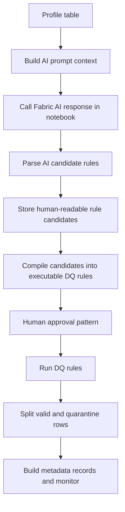

# AI-generated DQ rules workflow (Fabric notebook + framework)

This workflow treats AI-assisted DQ rule generation as a core pattern while keeping the framework provider-neutral.

## Responsibility split

| Layer | Responsibility |
|---|---|
| Fabric AI response | Generate candidate readable and technical rules |
| Framework | Prompt context, parsing, validation, compiling, execution |
| Human | Approve/reject rules |
| Power BI | Monitor DQ outcomes |

- Fabric AI is used in the notebook layer.
- The core framework does not directly call AI providers.
- This keeps the repo safe, portable, and testable.

## End-to-end flow

## Steps (A-J)

A. Profile table with `profile_dataframe`.
B. Build prompt using `build_quality_rule_prompt_context` and `build_quality_rule_generation_prompt`.
C. Call Fabric AI in notebook code (for example `ai.generate_response`) and collect raw text.
D. Parse/validate candidates with `parse_ai_quality_rule_candidates`, `normalize_quality_rule_candidate`, and `validate_ai_quality_rule_candidate`.
E. Store human-readable candidates with `build_layman_rule_records`.
F. Compile to executable rules using `compile_layman_rules_to_quality_rules`.
G. Human approves/rejects candidates; execute only approved compiled rules.
H. Run aggregate checks through `run_quality_rules`.
I. Run row-level split with `add_dq_failure_columns` + `split_valid_and_quarantine`.
J. Persist quality and quarantine summary records for monitoring/dashboarding.
