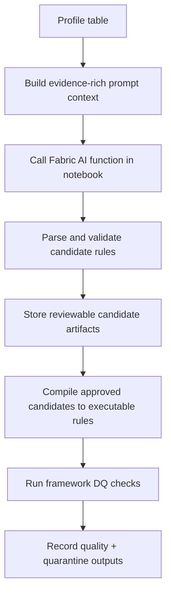

# AI-generated DQ rules workflow (Fabric notebook + framework)

This is the canonical AI workflow doc for data quality rule generation.

## Decision boundary

**AI proposes. Humans approve. The framework validates and records.**

## Responsibility split

| Layer | Responsibility |
|---|---|
| Fabric Copilot | Notebook/code/prompt authoring assistance for practitioners. |
| Fabric AI functions (execution-time, where available) | Generate candidate DQ rules from explicit prompt context. |
| Framework code | Build evidence context, parse outputs, validate shape, compile approved rules, execute checks, persist artifacts. |
| Human reviewer | Approve/reject AI candidates and decide whether a rule should be enforced. |

## Required evidence for AI suggestions

AI prompts should be grounded in explicit artifacts, not memory:
- Profile evidence (column stats, null behavior, value patterns).
- Metadata and contract context (critical fields, expectations, constraints).
- Business context (approved usage, caveats, known exclusions).

Do not depend on invisible chat history to define rules; all accepted rules must be reproducible from saved artifacts.

## End-to-end flow

## Steps

1. Profile source/output data with `profile_dataframe`.
2. Build prompt context with `build_quality_rule_prompt_context` and `build_quality_rule_generation_prompt`.
3. Call Fabric AI from notebook code (provider call stays outside the framework package).
4. Parse and validate candidates with `parse_ai_quality_rule_candidates`, `normalize_quality_rule_candidate`, and `validate_ai_quality_rule_candidate`.
5. Persist human-review artifacts with `build_layman_rule_records`.
6. Compile approved rules via `compile_layman_rules_to_quality_rules`.
7. Execute rules using `run_quality_rules` and gate with `assert_quality_gate` where required.
8. Produce row-level quarantine artifacts with `add_dq_failure_columns`, `split_valid_and_quarantine`, and `build_quarantine_summary_records`.

## Related docs
- Lifecycle placement: [../lifecycle-operating-model.md](../lifecycle-operating-model.md)
- API reference: [../../src/README.md](../../src/README.md)
