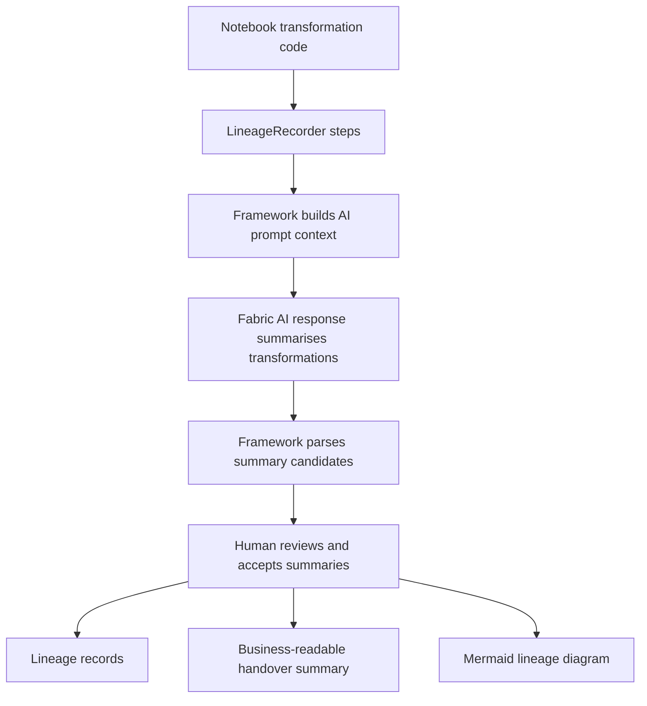

# AI-assisted transformation summaries

AI-assisted transformation summaries help bridge technical lineage and business handover by producing per-step narratives grounded in recorded evidence.

## Why this matters

- Improves handover quality for non-engineering stakeholders.
- Makes lineage steps easier to review and approve.
- Preserves risk/caveat context for operations and governance.

## Workflow

## Recommended implementation pattern

1. Record transformation steps with `LineageRecorder`.
2. Build lineage summary with `LineageRecorder.build_summary()`.
3. Build AI prompt context with `build_transformation_summary_prompt_context(...)`.
4. Generate strict prompt with `build_transformation_summary_generation_prompt(...)`.
5. Call Fabric AI summarise/generate response in the notebook layer.
6. Parse and validate candidates with `parse_ai_transformation_summaries(...)`.
7. Store reviewed candidates using `build_transformation_summary_records(...)`.
8. Feed accepted summaries into handover package, Mermaid lineage, and reporting tables.

## Provider-neutral boundary

- Fabric AI call stays in notebook orchestration code.
- Core framework does not import or call OpenAI/Azure OpenAI/Fabric AI functions.
- This keeps the repository portable, public-safe, and unit-testable.
